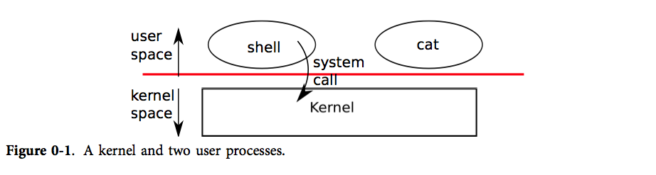
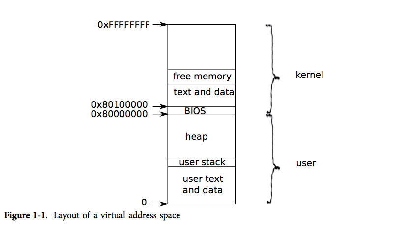
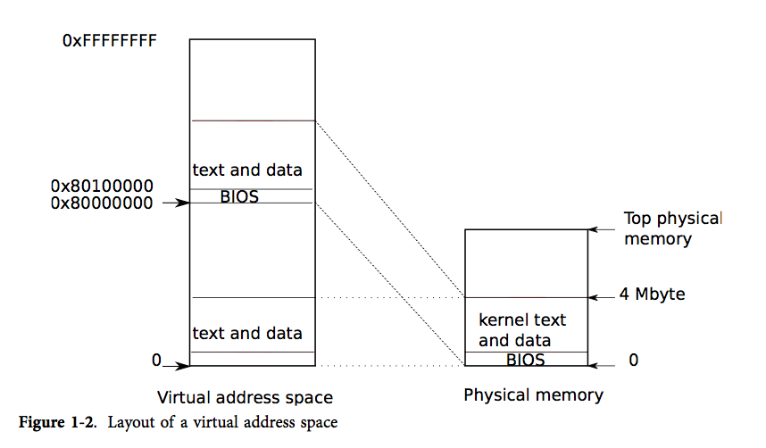
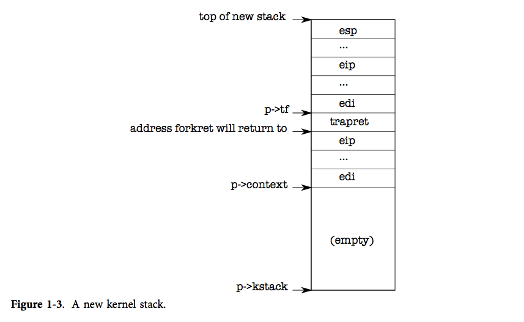
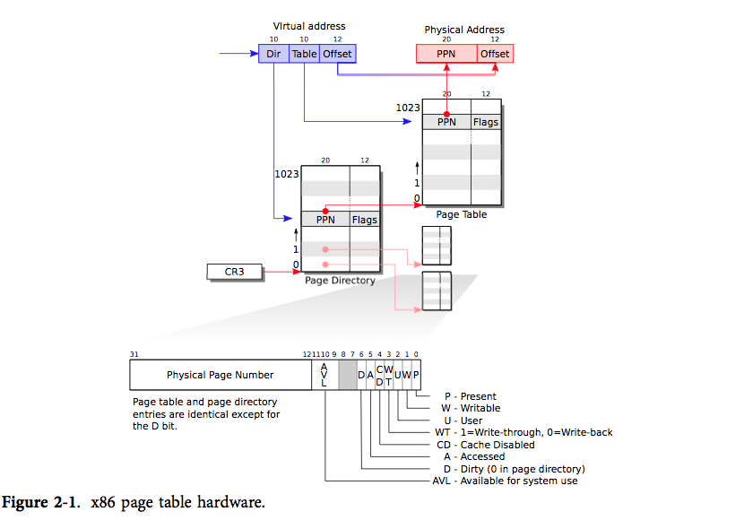
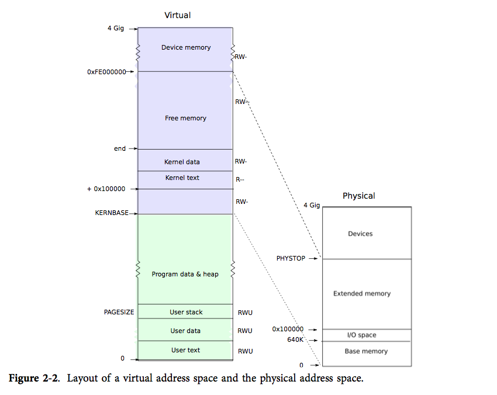
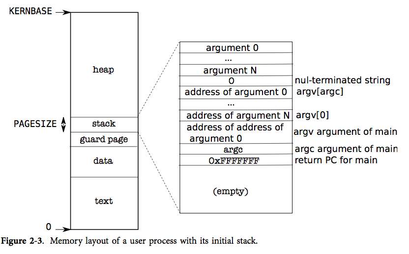
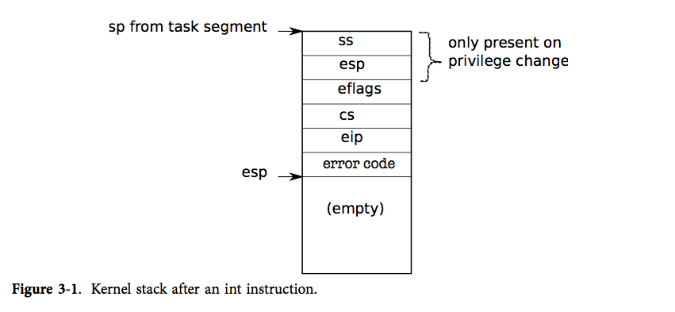
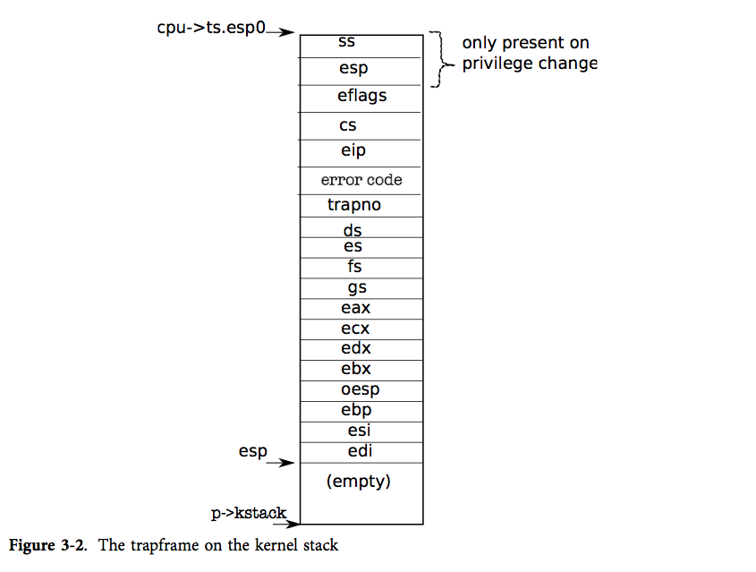

# wmt_xv6_study
[WIP] My xv6 document and sources study, based on jamesrxian/xv6-chinese

## References, books
* https://github.com/jamesrxian/xv6-chinese/tree/rev9
* xv6-chinese-rev9_chrome.pdf  
* use vscode plugins to print, see https://blog.csdn.net/m0_68997646/article/details/128612630  
* https://gitee.com/jindaliuzi/xv6-book-chinese  
* https://github.com/ranxian/xv6-chinese  
* https://www.bookstack.cn/read/xv6-chinese/README.md  
* https://www.zhihu.com/question/22463820  
写一个操作系统内核有多难？大概的内容、步骤是什么？  
* https://gitee.com/qison/xv6-book-chinese  
* https://pdos.csail.mit.edu/6.828/2016/tools.html  
* https://pdos.csail.mit.edu/6.828/2016/xv6/book-rev9.pdf  
* https://pdos.csail.mit.edu/6.828/2016/xv6/xv6-rev9.pdf  
* https://github.com/ranxian/xv6-chinese  
* http://pdos.csail.mit.edu/6.828/2012/xv6/book-rev7.pdf  
* http://pdos.csail.mit.edu/6.828/2012/xv6/xv6-rev7.pdf  
* 调试运行第一个xv6程序  
https://blog.csdn.net/u011675745/article/details/122890830  
* xv6-explained  
https://github.com/YehudaShapira/xv6-explained/blob/master/xv6%20Code%20Explained.md  
* Writing an OS shutdown process for QEMU (xv6)  
https://unix.stackexchange.com/questions/645618/writing-an-os-shutdown-process-for-qemu-xv6  
why Ctrl + a x not work ??? only use Ctrl Alt Q  
* UNIX xv6内核源码深入剖析  
xv6-rev11.pdf  
https://pdos.csail.mit.edu/6.828/2018/labs/lab1  
* xv6 bochs  
xv6试验环境bochs及qemu搭建  
https://blog.csdn.net/woxiaohahaa/article/details/49225447  
https://www.cnblogs.com/Sisyphean/p/xv6_bochs.html  
https://github.com/panks/Xv6  

## References, code
* https://github.com/mit-pdos/xv6-public  
* https://github.com/swbengs/Xv6_Lua_Shell  
* https://github.com/weimingtom/wmt_ai_study/blob/master/os_001.md
* https://github.com/salewski/xv6-minix2  
可能可以参考一下MIPS书计算机系统设计上里面的C库  
* All Labs implementation of 6.828 2018 OS course of MIT.  
https://github.com/k0Iry/xv6-jos-i386-lab  
* xv6   
https://gitee.com/hedonihilist/jos  
* xv6-riscv  
https://github.com/mit-pdos/xv6-riscv  
* xv6-k210  
https://github.com/HUST-OS/xv6-k210  
* xv6-rpi  
https://github.com/david50407/xv6-rpi  
* xv6 64bit  
https://github.com/swetland/xv6  
* xv6 d1  
https://github.com/michaelengel/xv6-d1  
* xv6 exp (based on xv6-rev9)    
https://github.com/luoszu/xv6-exp  
https://github.com/mit-pdos/xv6-public/releases/tag/xv6-rev9  

## Debugging, -g3 -gdwarf-2, make qemu-nox-gdb    
* 我搞明白怎么用gdb调试xv6了，而不会看到乱了的调用栈。其实很多书都没说清楚，  
包括我手头上的书。改Makefile，把-O3改成-g3 -gdwarf-2。  
如果是xv6-rev9，有一个很明确的提示在注释上，但新版故意去掉了。  
另外gdb甚至可以调试用户空间的程序，例如cat README，方法是  
```
(gdb) file _cat
(gdb) b main
```
然后就可以断在main函数处
* https://github.com/swetland/xv6  
* eclipse-cdt调试
```
在ubuntu 14下用gdb和Eclipse-CDT调试xv6-public。
（1）首先编译xv6-public xv6-rev9。最好用rev9版本，
因为Makefile里面注释掉的-g -gdwarf-2参数，需要修改打开。
sudo apt install qemu; make qemu-nox-gdb，用Ctrl+A X退出
（2）打开控制台的另一个tab，用gdb调试（生成gdbinit文件，需要自己写set auto-load safe-path /）。
（3）用Eclipse-CDT调试。sudo apt install eclipse-cdt，用eclipse命令打开，
创建工程选择Makefile, linux gcc，
然后添加remote gdb调试，gdb参数去掉.gdbinit留空白，目录选择xv6-public-xv6-rev9，
调试文件选择目录下的kernel即可。
connection选tcp，端口号26000
（4）其他gdb工具也可以，例如ddd，cgdb和gdbtui
```

## work_xv6_mingw, xv6 mingw    
* search baidupan, work_xv6_mingw, i686-elf-tools-windows.zip, xv6_mingw_patch_v1.rar  
```
//-Wno-stringop-overflow  
*(volatile char*)lastaddr = 99;  
```
* http://frippery.org/busybox/  
* https://github.com/alessandromrc/i686-elf-tools  
* https://qemu.weilnetz.de/w32/2014/
* method 1: modify Makefile, -O2->-O0  
on shell, Ctrl+P  
i686-elf-addr2line -f -e kernel 80104bb5  
* method 2, qemu gdbserver (QEMU windows version can stop itself with its GUI menu, to switch to gdb command line)    
```
QEMUGDB = $(shell echo "-gdb tcp:127.0.0.1:$(GDBPORT)")  
(gdb) target remote 127.0.0.1:25500  
```
* https://github.com/mirokuuno/xv6-windows  

## JOS  
* (make qemu) https://github.com/woai3c/MIT6.828  
* (unzip final.tar) https://github.com/clann24/jos  
* https://github.com/librabyte/6.828  
* unzip https://github.com/clann24/jos/blob/master/final/final.tar, under ubuntu 14.04 32bit    
```
unzip clann24_jos-master.zip
cd /work_jos/jos-master/final/lab
unzip final.tar
make qemu

gedit GNUmakefile, mod to gcc -pipe -std=gnu99
CC	:= $(GCCPREFIX)gcc -pipe -std=gnu99
gedit inc/mmu.h, and remove '(struct Segdesc)'

// Null segment
#define SEG_NULL	{ 0, 0, 0, 0, 0, 0, 0, 0, 0, 0, 0, 0, 0 }
// Segment that is loadable but faults when used
#define SEG_FAULT	{ 0, 0, 0, 0, 1, 0, 1, 0, 0, 0, 1, 0, 0 }
// Normal segment
#define SEG(type, base, lim, dpl) 			\
```
* https://pdos.csail.mit.edu/6.828/2010/labs/lab3/  
make run-hello  
* https://github.com/SmallPond/MIT6.828_OS  
* https://gitee.com/coolloser/jos  
* see mooc os  

## xv6 中文文档, 行号对应的版本为rev7
update 02/25/2016

2014 版的 xv6 (rev8) 相关文档正在翻译中，详见 `rev8` 分支。

xv6 是 MIT 开发的一个教学用的完整的类 Unix 操作系统，并且在 MIT 的操作系统课程 6.828, http://pdos.csail.mit.edu/6.828/2012/xv6.html 中使用。通过阅读并理解 xv6 的代码，可以清楚地了解操作系统中众多核心的概念，对操作系统感兴趣的同学十分推荐一读！这份文档是中文翻译的 MIT xv6 文档，是阅读代码过程中非常好的参考资料。

原文在此, http://pdos.csail.mit.edu/6.828/2012/xv6/book-rev7.pdf

文中引用的 xv6 源代码, http://pdos.csail.mit.edu/6.828/2012/xv6/xv6-rev7.pdf

强烈推荐 xv6 源代码同本书一同阅读！原作和翻译中遇到的括号内的数字，都是指上面链接中文件的源代码行号。

同时，我们的翻译文档也可以通过 gitbook, https://www.gitbook.io/book/th0ar/xv6-chinese 阅读   
[补注] see also https://www.bookstack.cn/read/xv6-chinese/README.md   

## 译者

* 鲜染 北京大学 信息科学技术学院 计算机系
* 赵天雨 北京大学 信息科学技术学院 计算机系
* 胡树伟 北京大学 信息科学技术学院 计算机系（I guess）
* 胡文涛 KAUST CS
* 曹扬 上海交通大学 电子信息与电气工程学院 计算机系
* 安润功 中国人民大学

*如果你愿意贡献，你的名字也会出现在这里！*

## 许可证（License）

文档中涉及到的 xv6 源代码使用 MIT, http://www.opensource.org/licenses/mit-license.php 许可证。中文翻译使用 GNU GPL V3.0, http://www.gnu.org/copyleft/gpl.html 许可证，在 GNU GPL V3.0 之上，转载和引用须注明本项目 Github 地址。

## 目录, 总结  
* 封面
* 前言
* 第零章 操作系统接口
* 第一章 第一个进程
* 第二章 页表
* 第三章 陷入，中断和驱动程序
* 第四章 锁
* 第五章 调度
* 第六章 文件系统
* 附录A PC 硬件
* 附录B 引导加载器
* 术语
* 勘误

## 封面
**xv6**

一个简单， 类 Unix 的教学操作系统

Russ Cox

Frans Kasshoek

Robert Morris

xv6-book@pdos.csail.mit.edu

翻译：

鲜染

xianran@pku.edu.cn

赵天雨

zhaoty.ting@gmail.com

2013年国庆

## 前言和致谢

这是一份为操作系统课编写的教学草案。它通过研究一个名为 xv6 的操作系统内核来解释操作系统中的主要概念。xv6 是 Dennis Ritchie 和 Ken Thompson 合著的 Unix Version 6（v6）操作系统的重新实现。xv6 在一定程度上遵守 v6 的结构和风格，但它是用 ANSI C 实现的，并且是基于 x86 多核处理器的。

这本教材应该和 xv6 源代码一起阅读，这是 John Lion 在 Unix 6th Edition（Peer to Peer Communications；ISBN：1-57398-013-7；第一版（2000年7月14日）的评注中推荐的学习方式。 参见http://pdos.csail.mit.edu/6.828 上有关于 v6 和 xv6 的资料。

我们已经在 6.828 —— MIT 的操作系统课程中使用了这本教材。我们向参与 6.828 的教职员工、助教和学生表示感谢，他们都直接或间接向 xv6 做出了贡献。此处我们要特别感谢 Austin Clements 和 Nicholai Zeldovich。

## 第0章

### 操作系统接口

操作系统的工作是
(1) 将计算机的资源在多个程序间共享，并且给程序提供一系列比硬件本身更有用的服务。  
(2) 管理并抽象底层硬件，举例来说，一个文字处理软件（比如 word）不用去关心自己使用的是何种硬盘。  
(3) 多路复用硬件，使得多个程序可以(至少看起来是)同时运行的。  
(4) 最后，给程序间提供一种受控的交互方式，使得程序之间可以共享数据、共同工作。  

操作系统通过接口向用户程序提供服务。设计一个好的接口实际上是很难的。一方面我们希望接口设计得简单和精准，使其易于正确地实现；另一方面，我们可能忍不住想为应用提供一些更加复杂的功能。解决这种矛盾的办法是让接口的设计依赖于少量的*机制* （*mechanism*)，而通过这些机制的组合提供强大、通用的功能。

本书通过 xv6 操作系统来阐述操作系统的概念，它提供 Unix 操作系统中的基本接口（由 Ken Thompson 和 Dennis Ritchie 引入），同时模仿 Unix 的内部设计。Unix 里机制结合良好的窄接口提供了令人吃惊的通用性。这样的接口设计非常成功，使得包括 BSD，Linux，Mac OS X，Solaris （甚至 Microsoft Windows 在某种程度上）都有类似 Unix 的接口。理解 xv6 是理解这些操作系统的一个良好起点。



```
用户空间   shell进程    cat进程
           系统调用
内核空间    内核

图 0-1. 内核与两个用户进程  
```

如图0-1所示，xv6 使用了传统的**内核**概念 - 一个向其他运行中程序提供服务的特殊程序。每一个运行中程序（称之为**进程**）都拥有包含指令、数据、栈的内存空间。指令实现了程序的运算，数据是用于运算过程的变量，栈管理了程序的过程调用。

进程通过**系统调用**使用内核服务。系统调用会进入内核，让内核执行服务然后返回。所以进程总是在用户空间和内核空间之间交替运行。

内核使用了 CPU 的硬件保护机制来保证用户进程只能访问自己的内存空间。内核拥有实现保护机制所需的硬件权限(hardware privileges)，而用户程序没有这些权限。当一个用户程序进行一次系统调用时，硬件会提升特权级并且开始执行一些内核中预定义的功能。

内核提供的一系列系统调用就是用户程序可见的操作系统接口，xv6 内核提供了 Unix 传统系统调用的一部分，它们是：

|系统调用 | 描述|
|--------|-----|
|fork() | 创建进程|
|exit() | 结束当前进程|
|wait() | 等待子进程结束|
|kill(pid) | 结束 pid 所指进程|
|getpid()| 获得当前进程 pid|
|sleep(n)| 睡眠 n 秒|
|exec(filename, *argv)| 加载并执行一个文件|
|sbrk(n)| 为进程内存空间增加 n 字节|
|open(filename, flags)| 打开文件，flags 指定读/写模式|
|read(fd, buf, n)| 从文件中读 n 个字节到 buf|
|write(fd, buf, n)| 从 buf 中写 n 个字节到文件|
|close(fd)| 关闭打开的 fd|
|dup(fd)| 复制 fd|
|pipe( p)| 创建管道， 并把读和写的 fd 返回到p|
|chdir(dirname)| 改变当前目录|
|mkdir(dirname)| 创建新的目录|
|mknod(name, major, minor)| 创建设备文件|
|fstat(fd)| 返回文件信息|
|link(f1, f2)| 给 f1 创建一个新名字(f2)|
|unlink(filename)| 删除文件|
```
图 0-2. Xv6 系统调用
```

这一章剩下的部分将说明 xv6 系统服务的概貌 —— 进程，内存，文件描述符，管道和文件系统，为了描述他们，我们给出了代码和一些讨论。这些系统调用在 shell 上的应用阐述了他们的设计是多么独具匠心。

shell 是一个普通的程序，它接受用户输入的命令并且执行它们，它也是传统 Unix 系统中最基本的用户界面。shell 作为一个普通程序，而不是内核的一部分，充分说明了系统调用接口的强大：shell 并不是一个特别的用户程序。这也意味着 shell 是很容易被替代的，实际上这导致了现代 Unix 系统有着各种各样的 shell，每一个都有着自己的用户界面和脚本特性。xv6 shell 本质上是一个 Unix Bourne shell 的简单实现。它的实现在第 7850 行。  
L7850, https://github.com/mit-pdos/xv6-public/blob/xv6-rev7/sh.c  
L8550, https://github.com/mit-pdos/xv6-public/blob/xv6-rev9/sh.c  

### 进程和内存

一个 xv6 进程由两部分组成，一部分是用户内存空间（指令，数据，栈），另一部分是仅对内核可见的进程状态。xv6 提供了分时特性：它在可用 CPU 之间不断切换，决定哪一个等待中的进程被执行。当一个进程不在执行时，xv6 保存它的 CPU 寄存器，当他们再次被执行时恢复这些寄存器的值。内核将每个进程和一个 **pid** (process identifier) 关联起来。

一个进程可以通过系统调用 `fork` 来创建一个新的进程。`fork` 创建的新进程被称为**子进程**，子进程的内存内容同创建它的进程（父进程）一样。`fork` 函数在父进程、子进程中都返回（一次调用两次返回）。对于父进程它返回子进程的 pid，对于子进程它返回 0。考虑下面这段代码：

~~~ C
int pid;
pid = fork();
if(pid > 0){
    printf("parent: child=%d\n", pid);
    pid = wait();
    printf("child %d is done\n", pid);
} else if(pid == 0){
    printf("child: exiting\n");
    exit();
} else {
    printf("fork error\n");
}
~~~

系统调用 `exit` 会导致调用它的进程停止运行，并且释放诸如内存和打开文件在内的资源。系统调用 `wait` 会返回一个当前进程已退出的子进程，如果没有子进程退出，`wait` 会等候直到有一个子进程退出。在上面的例子中，下面的两行输出

~~~
parent: child=1234
child: exiting
~~~

可能以任意顺序被打印，这种顺序由父进程或子进程谁先结束 `printf` 决定。当子进程退出时，父进程的 `wait` 也就返回了，于是父进程打印：

~~~
parent: child 1234 is done
~~~

需要留意的是父子进程拥有不同的内存空间和寄存器，改变一个进程中的变量不会影响另一个进程。

系统调用 `exec` 将从某个*文件*（通常是可执行文件）里读取内存镜像，并将其替换到调用它的进程的内存空间。这份文件必须符合特定的格式，规定文件的哪一部分是指令，哪一部分是数据，哪里是指令的开始等等。xv6 使用 ELF 文件格式，第2章将详细介绍它。当`exec`执行成功后，它并不返回到原来的调用进程，而是从ELF头中声明的入口开始，执行从文件中加载的指令。`exec` 接受两个参数：可执行文件名和一个字符串参数数组。举例来说：

~~~ C
char *argv[3];

argv[0] = "echo";
argv[1] = "hello";
argv[2] = 0;
exec("/bin/echo", argv);
printf("exec error\n");
~~~

这段代码将调用程序替换为 `/bin/echo` 这个程序，这个程序的参数列表为`echo hello`。大部分的程序都忽略第一个参数，这个参数惯例上是程序的名字（此例是 echo）。

xv6 shell 用以上调用为用户执行程序。shell 的主要结构很简单，详见 `main` 的代码（8001）。  
L8001, https://github.com/mit-pdos/xv6-public/blob/xv6-rev7/sh.c#L145  
L8701, https://github.com/mit-pdos/xv6-public/blob/xv6-rev9/sh.c#L145  
主循环通过 `getcmd` 读取命令行的输入，然后它调用 `fork` 生成一个 shell 进程的副本。父 shell 调用 `wait`，而子进程执行用户命令。举例来说，用户在命令行输入“echo hello”，`getcmd` 会以 `echo hello` 为参数调用 `runcmd`（7906）,   
L7906, https://github.com/mit-pdos/xv6-public/blob/xv6-rev7/sh.c#L58   
L8606, https://github.com/mit-pdos/xv6-public/blob/xv6-rev9/sh.c#L58  
由 `runcmd` 执行实际的命令。对于 `echo hello`, `runcmd` 将调用 `exec` 。  
L????, https://github.com/mit-pdos/xv6-public/blob/xv6-rev7/sh.c#L78   
L8626, https://github.com/mit-pdos/xv6-public/blob/xv6-rev9/sh.c#L78   
如果 `exec` 成功被调用，子进程就会转而去执行 `echo` 程序里的指令。在某个时刻 `echo` 会调用 `exit`，这会使得其父进程从 `wait` 返回。
```
注：这里的rev9版改为【从main函数中的 `wait` 返回】, L8701指main函数      
```
L????, https://github.com/mit-pdos/xv6-public/blob/xv6-rev7/sh.c#L145  
L8701, https://github.com/mit-pdos/xv6-public/blob/xv6-rev9/sh.c#L145  
你可能会疑惑为什么 `fork` 和 `exec` 没有被合并成一个调用，我们之后将会发现，将创建进程——加载程序分为两个过程是一个非常机智的设计。
```
注:这里[疑惑为什么 `fork` 和 `exec` 为什么] 有两个为什么 去掉后面的为什么
```

xv6 通常隐式地分配用户的内存空间。`fork` 在子进程需要装入父进程的内存拷贝时分配空间，`exec` 在需要装入可执行文件时分配空间。一个进程在需要额外内存时可以通过调用 `sbrk(n)` 来增加 n 字节的数据内存。 `sbrk` 返回新的内存的地址。

xv6 没有用户这个概念当然更没有不同用户间的保护隔离措施。按照 Unix 的术语来说，所有的 xv6 进程都以 root 用户执行。

### I/O 和文件描述符

**文件描述符**是一个整数，它代表了一个进程可以读写的被内核管理的对象。进程可以通过多种方式获得一个文件描述符，如打开文件、目录、设备，或者创建一个管道（pipe），或者复制已经存在的文件描述符。简单起见，我们常常把文件描述符指向的对象称为“文件”。文件描述符的接口是对文件、管道、设备等的抽象，这种抽象使得它们看上去就是字节流。

每个进程都有一张表，而 xv6 内核就以文件描述符作为这张表的索引，所以每个进程都有一个从0开始的文件描述符空间。按照惯例，进程从文件描述符0读入（标准输入），从文件描述符1输出（标准输出），从文件描述符2输出错误（标准错误输出）。我们会看到 shell 正是利用了这种惯例来实现 I/O 重定向。shell 保证在任何时候都有3个打开的文件描述符（8007），  
L8007, https://github.com/mit-pdos/xv6-public/blob/xv6-rev7/sh.c#L151   
L8707, https://github.com/mit-pdos/xv6-public/blob/xv6-rev9/sh.c#L151   
他们是控制台（console）的默认文件描述符。

系统调用 `read` 和 `write` 从文件描述符所指的文件中读或者写 n 个字节。`read(fd, buf, n)` 从 `fd` 读最多 n 个字节（`fd` 可能没有 n 个字节），将它们拷贝到 `buf` 中，然后返回读出的字节数。每一个指向文件的文件描述符都和一个偏移关联。`read` 从当前文件偏移处读取数据，然后把偏移增加读出字节数。紧随其后的 `read` 会从新的起点开始读数据。当没有数据可读时，`read` 就会返回0，这就表示文件结束了。

`write(fd, buf, n)` 写 `buf` 中的 n 个字节到 `fd` 并且返回实际写出的字节数。如果返回值小于 n 那么只可能是发生了错误。就像 `read` 一样，`write` 也从当前文件的偏移处开始写，在写的过程中增加这个偏移。

下面这段程序（实际上就是 `cat` 的本质实现）将数据从标准输入复制到标准输出，如果遇到了错误，它会在标准错误输出输出一条信息。

~~~ C
char buf[512];
int n;

for(;;){
	n = read(0, buf, sizeof buf);
	if(n == 0)
    	break;
    if(n < 0){
        fprintf(2, "read error\n");
		exit();
	}
    if(write(1, buf, n) != n){
    	fprintf(2, "write error\n");
        exit();
	}
}
~~~

这段代码中值得一提的是 `cat` 并不知道它是从文件、控制台或者管道中读取数据的。同样地 `cat` 也不知道它是写到文件、控制台或者别的什么地方。文件描述符的使用和一些惯例（如0是标准输入，1是标准输出）使得我们可以轻松实现 `cat`。

系统调用 `close` 会释放一个文件描述符，使得它未来可以被 `open`, `pipe`, `dup` 等调用重用。一个新分配的文件描述符永远都是当前进程的最小的未被使用的文件描述符。

文件描述符和 `fork` 的交叉使用使得 I/O 重定向能够轻易实现。`fork` 会复制父进程的文件描述符和内存，所以子进程和父进程的文件描述符一模一样。`exec` 会替换调用它的进程的内存但是会保留它的文件描述符表。这种行为使得 shell 可以这样实现重定向：`fork` 一个进程，重新打开指定文件的文件描述符，然后执行新的程序。下面是一个简化版的 shell 执行 `cat<input.txt` 的代码:

~~~ C
char *argv[2];

argv[0] = "cat";
argv[1] = 0;
if(fork() == 0) {
	close(0);
	open("input.txt", O_RDONLY);
    exec("cat", argv);
}
~~~

子进程关闭文件描述符0后，我们可以保证`open` 会使用0作为新打开的文件 `input.txt`的文件描述符（因为0是 `open` 执行时的最小可用文件描述符）。之后 `cat` 就会在标准输入指向 `input.txt` 的情况下运行。

xv6 的 shell 正是这样实现 I/O 重定位的（7930）。  
L7930, https://github.com/mit-pdos/xv6-public/blob/xv6-rev9/sh.c#L82   
L8630, https://github.com/mit-pdos/xv6-public/blob/xv6-rev7/sh.c#L82  
在 shell 的代码中，记得这时 `fork` 出了子进程，在子进程中 `runcmd` 会调用 `exec` 加载新的程序。现在你应该很清楚为何 `fork` 和 `exec` 是单独的两种系统调用了吧。这种区分使得 shell 可以在子进程执行指定程序之前对子进程进行修改。

虽然 `fork` 复制了文件描述符，但每一个文件当前的偏移仍然是在父子进程之间共享的，考虑下面这个例子：

~~~ C
if(fork() == 0) {
	write(1, "hello ", 6);
	exit();
} else {
	wait();
	write(1, "world\n", 6);
}
~~~

在这段代码的结尾，绑定在文件描述符1上的文件有数据"hello world"，父进程的 `write` 会从子进程 `write` 结束的地方继续写 (因为 `wait` ,父进程只在子进程结束之后才运行 `write`)。这种行为有利于顺序执行的 shell 命令的顺序输出，例如 `(echo hello; echo world)>output.txt`。

`dup` 复制一个已有的文件描述符，返回一个指向同一个输入/输出对象的新描述符。这两个描述符共享一个文件偏移，正如被 `fork` 复制的文件描述符一样。这里有另一种打印 “hello world” 的办法：

~~~ C
fd = dup(1);
write(1, "hello ", 6);
write(fd, "world\n", 6);
~~~

从同一个原初文件描述符通过一系列 `fork` 和 `dup` 调用产生的文件描述符都共享同一个文件偏移，而其他情况下产生的文件描述符就不是这样了，即使他们打开的都是同一份文件。`dup` 允许 shell 像这样实现命令：`ls existing-file non-exsiting-file > tmp1 2>&1`. `2>&1` 告诉 shell 给这条命令一个复制描述符1的描述符2。这样 `existing-file` 的名字和 `non-exsiting-file` 的错误输出都将出现在 `tmp1` 中。xv6 shell 并未实现标准错误输出的重定向，但现在你知道该怎么去实现它。

文件描述符是一个强大的抽象，因为他们将他们所连接的细节隐藏起来了：一个进程向描述符1写出，它有可能是写到一份文件，一个设备（如控制台），或一个管道。

### 管道

管道是一个小的内核缓冲区，它以文件描述符对的形式提供给进程，一个用于写操作，一个用于读操作。从管道的一端写的数据可以从管道的另一端读取。管道提供了一种进程间交互的方式。

接下来的示例代码运行了程序 `wc`，它的标准输出绑定到了一个管道的读端口。

~~~ C
int p[2];
char *argv[2];

argv[0] = "wc";
argv[1] = 0;

pipe(p);
if(fork() == 0) {
	close(0);
	dup(p[0]);
	close(p[0]);
	close(p[1]);
	exec("/bin/wc", argv);
} else {
	write(p[1], "hello world\n", 12);
	close(p[0]);
	close(p[1]);
}
~~~

这段程序调用 `pipe`，创建一个新的管道并且将读写描述符记录在数组 `p` 中。在 `fork` 之后，父进程和子进程都有了指向管道的文件描述符。子进程将管道的读端口拷贝在描述符0上，关闭 `p` 中的描述符，然后执行 `wc`。当 `wc` 从标准输入读取时，它实际上是从管道读取的。父进程向管道的写端口写入然后关闭它的两个文件描述符。

如果数据没有准备好，那么对管道执行的`read`会一直等待，直到有数据了或者其他绑定在这个管道写端口的描述符都已经关闭了。在后一种情况中，`read` 会返回 0，就像是一份文件读到了最后。读操作会一直阻塞直到不可能再有新数据到来了，这就是为什么我们在执行 `wc` 之前要关闭子进程的写端口。如果 `wc` 指向了一个管道的写端口，那么 `wc` 就永远看不到 eof 了。

xv6 shell 对管道的实现（比如 `fork sh.c | wc -l`）和上面的描述是类似的（7950行）。  
L7950, https://github.com/mit-pdos/xv6-public/blob/xv6-rev7/sh.c#L100   
L8650, https://github.com/mit-pdos/xv6-public/blob/xv6-rev9/sh.c#L100  
子进程创建一个管道连接管道的左右两端。然后它为管道左右两端都调用 `runcmd`，然后通过两次 `wait` 等待左右两端结束。管道右端可能也是一个带有管道的指令，如 `a | b | c`, 它 `fork` 两个新的子进程（一个 `b` 一个 `c`），因此，shell 可能创建出一颗进程树。树的叶子节点是命令，中间节点是进程，它们会等待左子和右子执行结束。理论上，你可以让中间节点都运行在管道的左端，但做的如此精确会使得实现变得复杂。

pipe 可能看上去和临时文件没有什么两样：命令

`echo hello world | wc`

可以用无管道的方式实现：

`echo hello world > /tmp/xyz; wc < /tmp/xyz`

但管道和临时文件起码有三个关键的不同点。首先，管道会进行自我清扫，如果是 shell 重定向的话，我们必须要在任务完成后删除 `/tmp/xyz`。第二，管道可以传输任意长度的数据。第三，管道允许同步：两个进程可以使用一对管道来进行二者之间的信息传递，每一个读操作都阻塞调用进程，直到另一个进程用 `write` 完成数据的发送。

### 文件系统

xv6 文件系统提供文件和目录，文件就是一个简单的字节数组，而目录包含指向文件和其他目录的引用。xv6 把目录实现为一种特殊的文件。目录是一棵树，它的根节点是一个特殊的目录 `root`。`/a/b/c` 指向一个在目录 `b` 中的文件 `c`，而 b 本身又是在目录 `a` 中的，`a` 又是处在 `root` 目录下的。不从 `/` 开始的目录表示的是相对调用进程当前目录的目录，调用进程的当前目录可以通过 `chdir` 这个系统调用进行改变。下面的这些代码都打开同一个文件（假设所有涉及到的目录都是存在的）。

~~~ C
chdir("/a");
chdir("b");
open("c", O_RDONLY);

open("/a/b/c", O_RDONLY);
~~~

第一个代码段将当前目录切换到 `/a/b`; 第二个代码片段则对当前目录不做任何改变。

有很多的系统调用可以创建一个新的文件或者目录：`mkdir` 创建一个新的目录，`open` 加上 `O_CREATE` 标志打开一个新的文件，`mknod` 创建一个新的设备文件。下面这个例子说明了这3种调用：

~~~ C
mkdir("/dir");
fd = open("/dir/file", O_CREATE|O_WRONLY);
close(fd);
mknod("/console", 1, 1);
~~~

```
注:此处翻译有笔误,应该是O_WRONLY不是O_WRONGLY
```

`mknod` 在文件系统中创建一个文件，但是这个文件没有任何内容。相反，这个文件的元信息标志它是一个设备文件，并且记录主设备号和辅设备号（`mknod` 的两个参数），这两个设备号唯一确定一个内核设备。当一个进程之后打开这个文件的时候，内核将读、写的系统调用转发到内核设备的实现上，而不是传递给文件系统。

`fstat` 可以获取一个文件描述符指向的文件的信息。它填充一个名为 `stat` 的结构体，它在 `stat.h` 中定义为：

~~~ C
#define T_DIR  1   // Directory 目录
#define T_FILE 2   // File 文件
#define T_DEV  3   // Device 设备

struct stat {
  short type;  // Type of file 文件类型
  int dev;     // File system's disk device 文件系统的磁盘设备
  uint ino;    // Inode number 索引节点数
  short nlink; // Number of links to file 链接到文件的数量
  uint size;   // Size of file in bytes 字节单位的文件大小
};
~~~

文件名和这个文件本身是有很大的区别。同一个文件（称为 `inode`）可能有多个名字，称为**连接** (`links`)。系统调用 `link` 创建另一个文件系统的名称，它指向同一个 `inode`。下面的代码创建了一个既叫做 `a` 又叫做 `b` 的新文件。

~~~ C
open("a", O_CREATE|O_WRONLY);
link("a", "b");
~~~

```
注:此处翻译有笔误,应该是O_WRONLY不是O_WRONGLY
```

读写 `a` 就相当于读写 `b`。每一个 inode 都由一个唯一的 `inode 号` 直接确定。在上面这段代码中，我们可以通过 `fstat` 知道 `a` 和 `b` 都指向同样的内容：`a` 和 `b` 都会返回同样的 inode 号（`ino`），并且 `nlink` 数会设置为2。

系统调用 `unlink` 从文件系统移除一个文件名。一个文件的 inode 和磁盘空间只有当它的链接数变为 0 的时候才会被清空，也就是没有一个文件再指向它。因此在上面的代码最后加上

`unlink("a")`，

我们同样可以通过 `b` 访问到它。另外，

~~~ C
fd = open("/tmp/xyz", O_CREATE|O_RDWR);
unlink("/tmp/xyz");
~~~

是创建一个临时 inode 的最佳方式，这个 inode 会在进程关闭 `fd` 或者退出的时候被清空。

xv6 关于文件系统的操作都被实现为用户程序，诸如 `mkdir`，`ln`，`rm` 等等。这种设计允许任何人都可以通过用户命令拓展 shell 。现在看起来这种设计是很显然的，但是 Unix 时代的其他系统的设计都将这样的命令内置在了 shell 中，而 shell 又是内置在内核中的。

有一个例外，那就是 `cd`，它是在 shell 中实现的（8016）。  
L8016, https://github.com/mit-pdos/xv6-public/blob/xv6-rev7/sh.c#L160  
L8716, https://github.com/mit-pdos/xv6-public/blob/xv6-rev9/sh.c#L160    
`cd` 必须改变 shell 自身的当前工作目录。如果 `cd` 作为一个普通命令执行，那么 shell 就会 `fork` 一个子进程，而子进程会运行 `cd`，`cd` 只会改变*子进程*的当前工作目录。父进程的工作目录保持原样。

### 现实情况

UNIX 将“标准”的文件描述符，管道，和便于操作它们的 shell 命令整合在一起，这是编写通用、可重用程序的重大进步。这个想法激发了 UNIX 强大和流行的“软件工具”文化，而且 shell 也是首个所谓的“脚本语言”。UNIX 的系统调用接口在今天仍然存在于许多操作系统中，诸如 BSD，Linux，以及 Mac OS X。

现代内核提供了比 xv6 要多得多的系统调用和内核服务。最重要的一点，现代基于 Unix 的操作系统并不遵循早期 Unix 将设备暴露为特殊文件的设计，比如刚才所说的控制台文件。Unix 的作者继续打造Plan 9 项目，它将“资源是文件”的概念应用到现代设备上，将网络、图形和其他资源都视作文件或者文件树。

文件系统抽象是一个强大的想法，它被以万维网的形式广泛的应用在互联网资源上。即使如此，也存在着其他的操作系统接口的模型。Multics，一个 Unix 的前辈，将文件抽象为一种类似内存的概念，产生了十分不同的系统接口。Multics 的设计的复杂性对 Unix 的设计者们产生了直接的影响，他们因此想把文件系统的设计做的更简单。

这本书考察 xv6 是如何实现类似 Unix 的接口的，但涉及的想法和概念可以运用到 Unix 之外很多地方上。任何一个操作系统都需要让多个进程复用硬件，实现进程之间的相互隔离，并提供进程间通讯的机制。在学习 xv6 之后，你应该了解一些其他的更加复杂的操作系统，看一下他们当中蕴含的 xv6 的概念。

## 第1章
```
注:
类似这样的 %cr3 和 %cs 都是AT&T汇编语言语法下的寄存器, 用%号开头. 如果是Intel语法则不需要%号开头    
AT&T汇编语言语法也适用于GCC内联汇编  
AT&T语法下的操作符, 使用不同的字母后缀表示操作数大小, 例如movl的l代表32位, 但Intel语法不需要  
```
* 注: https://blog.csdn.net/g2h3i4j5/article/details/156031982
* 注: https://blog.csdn.net/wfwfunway/article/details/4029694  

### 第一个进程

本章通过第一个进程的创建来解释 xv6 是如何开始运行的，让我们得以一窥 xv6 提供的各个抽象是如何实现和交互的。xv6 尽量复用了普通操作的代码来建立第一个进程，避免单独为其撰写代码。接下来的各小节中，我们将详细探索其中的奥秘。

xv6 可以运行在搭载 Intel 80386 及其之后（即"x86"）处理器的 PC 上，因而许多底层功能（例如虚存的实现）是 x86 处理器专有的。本书假设读者已有些许在一些体系结构上进行机器级编程的经验。我们将在有关 x86 专有概念出现时，对其进行介绍。另外，附录 A 中简要地描述了 PC 平台的整体架构。

#### 进程概览

进程是一个抽象概念，它让一个程序可以假设它独占一台机器。进程向程序提供“看上去”私有的，其他进程无法读写的内存系统（或地址空间），以及一颗“看上去”仅执行该程序的CPU。

xv6 使用页表（由硬件实现）来为每个进程提供其独有的地址空间。页表将*虚拟地址*（x86 指令所使用的地址）翻译（或说“映射”）为*物理地址*（处理器芯片向主存发送的地址）。



xv6 为每个进程维护了不同的页表，这样就能够合理地定义进程的地址空间了。如图表1-1所示，一片地址空间包含了从虚拟地址0开始的*用户内存*。它的地址最低处放置进程的指令，接下来则是全局变量，栈区，以及一个用户可按需拓展的“堆”区（malloc 用）。

和上面提到的*用户内存*一样，内核的指令和数据也会被进程映射到每个进程的地址空间中。当进程使用系统调用时，系统调用实际上会在进程地址空间中的内核区域执行。这种设计使得内核的系统调用代码可以直接指向用户内存。为了给用户留下足够的内存空间，xv6 将内核映射到了地址空间的高地址处，即从 0x80100000 开始。

xv6 使用结构体 `struct proc` 来维护一个进程的状态，   
L????, https://github.com/mit-pdos/xv6-public/blob/xv6-rev7/proc.h#L55  
L2353, https://github.com/mit-pdos/xv6-public/blob/xv6-rev9/proc.h#L52  
其中最为重要的状态是进程的页表，内核栈，当前运行状态。我们接下来会用 `p->xxx` 来指代 `proc` 结构中的元素。

每个进程都有一个运行线程（或简称为*线程*）来执行进程的指令。线程可以被暂时挂起，稍后再恢复运行。系统在进程之间切换实际上就是挂起当前运行的线程，恢复另一个进程的线程。线程的大多数状态（局部变量和函数调用的返回地址）都保存在线程的栈上。

每个进程都有用户栈和内核栈（`p->kstack`）。当进程运行用户指令时，只有其用户栈被使用，其内核栈则是空的。然而当进程（通过系统调用或中断）进入内核时，内核代码就在进程的内核栈中执行；进程处于内核中时，其用户栈仍然保存着数据，只是暂时处于不活跃状态。进程的线程交替地使用着用户栈和内核栈。要注意内核栈是用户代码无法使用的，这样即使一个进程破坏了自己的用户栈，内核也能保持运行。

当进程使用系统调用时，处理器转入内核栈中，提升硬件的特权级，然后运行系统调用对应的内核代码。当系统调用完成时，又从内核空间回到用户空间：降低硬件特权级，转入用户栈，恢复执行系统调用指令后面的那条用户指令。线程可以在内核中“阻塞”，等待 I/O, 在 I/O 结束后再恢复运行。

`p->state` 指示了进程的状态：新建、准备运行、运行、等待 I/O 或退出状态中。

`p->pgdir` 以 x86 硬件要求的格式保存了进程的页表。xv6 让分页硬件在进程运行时使用 `p->pgdir`。进程的页表还记录了保存进程内存的物理页的地址。

#### 代码：第一个地址空间



当 PC 开机时，它会初始化自己然后从磁盘中载入 *boot loader* 到内存并运行。附录 B 介绍了其具体细节。然后，*boot loader* 把 xv6 内核从磁盘中载入并从 `entry`（1040）开始运行。  
L1040, https://github.com/mit-pdos/xv6-public/blob/xv6-rev7/entry.S#L41    
L1144, https://github.com/mit-pdos/xv6-public/blob/xv6-rev9/entry.S#L45      
x86 的分页硬件在此时还没有开始工作；所以这时的虚拟地址是直接映射到物理地址上的。

boot loader 把 xv6 内核装载到物理地址 0x100000 处。之所以没有装载到内核指令和内核数据应该出现的 0x80100000，是因为小型机器上很可能没有这么大的物理内存。而之所以在 0x100000 而不是 0x0 则是因为地址 0xa0000 到 0x100000 是属于 I/O 设备的。

为了让内核的剩余部分能够运行，`entry` 的代码设置了页表，将 0x80000000（称为 `KERNBASE`（0207））开始的虚拟地址映射到物理地址 0x0 处。  
L0207, https://github.com/mit-pdos/xv6-public/blob/xv6-rev7/memlayout.h#L8   
L????, https://github.com/mit-pdos/xv6-public/blob/xv6-rev9/memlayout.h#L8   
注意，页表经常会这样把两段不同的虚拟内存映射到相同的一段物理内存，我们将会看到更多类似的例子。

`entry` 中的页表的定义在 `main.c`（1311）中。  
L1311, https://github.com/mit-pdos/xv6-public/blob/xv6-rev7/main.c#L107    
L1412, https://github.com/mit-pdos/xv6-public/blob/xv6-rev9/main.c#L106    
我们将在第 2 章讨论页表的细节，这里简单地说明一下，页表项 0 将虚拟地址 0:0x400000 映射到物理地址 0:0x400000。只要 `entry` 的代码还运行在内存的低地址处，我们就必须这样设置，但最后这个页表项是会被移除的。页表项 512
```
（译注：原文中似乎误写为960）
注: rev9版也是改成 Entry 512 (页表项 512)  
```
将虚拟地址的 KERNBASE:KERNBASE+0x400000 映射到物理地址 0:0x400000。这个页表项将在 `entry` 的代码结束后被使用；它将内核指令和内核数据应该出现的高虚拟地址处映射到了 *boot loader* 实际将它们载入的低物理地址处。这个映射就限制内核的指令+代码必须在 4mb 以内。

让我们回到 `entry` 中继续页表的设置工作，它将 `entrypgdir` 的物理地址载入到控制寄存器 `%cr3` 中。分页硬件必须知道 `entrypgdir` 的物理地址，因为此时它还不知道如何翻译虚拟地址；它也还没有页表。`entrypgdir` 这个符号指向内存的高地址处，但只要用宏 `V2P_WO`（0220）减去 `KERNBASE` 便可以找到其物理地址。  
L0220, https://github.com/mit-pdos/xv6-public/blob/xv6-rev7/memlayout.h#L21      
L0213, https://github.com/mit-pdos/xv6-public/blob/xv6-rev9/memlayout.h#L14    
为了让分页硬件运行起来， xv6 会设置控制寄存器 `%cr0` 中的标志位 `CR0_PG`。

现在 `entry` 就要跳转到内核的 C 代码，并在内存的高地址中执行它了。首先它将栈指针 `%esp` 指向被用作栈的一段内存（1054）。    
L1054, https://github.com/mit-pdos/xv6-public/blob/xv6-rev7/entry.S#L55    
L1158, https://github.com/mit-pdos/xv6-public/blob/xv6-rev9/entry.S#L59    
所有的符号包括 `stack` 都在高地址，所以当低地址的映射被移除时，栈仍然是可用的。最后 `entry` 跳转到高地址的 `main` 代码中。我们必须使用间接跳转，否则汇编器会生成 PC 相关的直接跳转（PC-relative direct jump），而该跳转会运行在内存低地址处的 `main`。 `main` 不会返回，因为栈上并没有返回 PC 值。好了，现在内核已经运行在高地址处的函数 `main`（1217）中了。   
L1217, https://github.com/mit-pdos/xv6-public/blob/xv6-rev7/main.c#L18    
L1317, https://github.com/mit-pdos/xv6-public/blob/xv6-rev7/main.c#L18   

#### 代码：创建第一个进程

在 `main` 初始化了一些设备和子系统后，
L????,  
L1317,  
它通过调用 `userinit`（1239）建立了第一个进程。   
L1239,   
L2502,   
`userinit` 首先调用 `allocproc`。`allocproc`（2205）的工作是在页表中分配一个槽（即结构体 `struct proc`），  
L2205,  
L2456,  
并初始化进程的状态，为其内核线程的运行做准备。注意一点：`userinit` 仅仅在创建第一个进程时被调用，而 `allocproc` 创建每个进程时都会被调用。`allocproc` 会在 `proc` 的表中找到一个标记为 `UNUSED`(2211-2213)的槽位。  
L2211-2213,   
L2461-2463,  
当它找到这样一个未被使用的槽位后，`allocproc` 将其状态设置为 `EMBRYO`，使其被标记为被使用的并给这个进程一个独有的 `pid`（2201-2219）。    
L2201-2219,   
L2451-2468,  
接下来，它尝试为进程的内核线程分配内核栈。如果分配失败了，`allocproc` 会把这个槽位的状态恢复为 `UNUSED` 并返回0以标记失败。



现在 `allocproc` 必须设置新进程的内核栈，`allocproc` 以巧妙的方式，使其既能在创建第一个进程时被使用，又能在 `fork` 操作时被使用。`allocproc` 为新进程设置好一个特别准备的内核栈和一系列内核寄存器，使得进程第一次运行时会“返回”到用户空间。准备好的内核栈就像图表1-3展示的那样。`allocproc` 通过设置返回程序计数器的值，使得新进程的内核线程首先运行在 `forkret` 的代码中，然后返回到 `trapret`（2236-2241）中运行。   
L2236-2241,   
L2484-2489,  
内核线程会从 `p->context` 中拷贝的内容开始运行。所以我们可以通过将 `p->context->eip` 指向 `forkret` 从而让内核线程从 `forkret`（2533）的开头开始运行。   
L2533,   
L2788,   
这个函数会返回到那个时刻栈底的地址。`context switch`（2708）的代码把栈指针指向 `p->context` 结尾。   
L2708,   
L2958,   
`allocproc` 又将 `p->context` 放在栈上，并在其上方放一个指向 `trapret` 的指针；这样运行完的 `forkret` 就会返回到 `trapret` 中了。 `trapret` 接着从栈顶恢复用户寄存器然后跳转到用户进程执行。   
L????,   
L3277,   
这样的设置对于普通的 `fork` 和建立第一个进程都是适用的，虽然后一种情况进程会从用户空间的地址0处开始执行而非真正的从 `fork` 返回。

我们将会在第3章看到，将控制权从用户转到内核是通过中断机制实现的，中断具体地说是系统调用、中断和异常。每当进程运行中要将控制权交给内核时，硬件和 xv6 的 `trap entry` 代码就会在进程的内核栈上保存用户寄存器。 `userinit` 把值写在新建的栈的顶部，使之就像进程是通过中断进入内核的一样（2264-2270）。   
L2264-2270,   
L2516-2522,  
所以用于从内核返回到用户代码的通用代码也就能适用于第一个进程。这些保存的值就构成了一个结构体 `struct trapframe`，其中保存的是用户寄存器。现在如图表1-3所示，进程的内核栈已经完全准备好了。

第一个进程会先运行一个小程序（`initcode.S`（7700）），   
L7700,  
L8400,  
于是进程需要找到物理内存来保存这段程序。程序不仅需要被拷贝到内存中，还需要页表来指向那段内存。

最初，`userinit` 调用 `setupkvm`（1737）来为进程创建一个只映射了内核区的页表。   
L1737,   
L1837,  
我们将在第2章学习该函数的具体细节。总之，`setupkvm` 和 `userinit` 创建了图表1-1所示的地址空间。

第一个进程内存中的初始内容是汇编过的 `initcode.S`；作为建立进程内核区的一步，链接器将这段二进制代码嵌入内核中并定义两个特殊的符号：`_binary_initcode_start` 和 `_binary_initcode_size`，用于表示这段代码的位置和大小。然后，`userinit` 调用 `inituvm`，分配一页物理内存，将虚拟地址0映射到那一段内存，并把这段代码拷贝到那一页中（1803）。   
L1803,    
L1903,   

接下来，`userinit` 把 `trap frame`（0602）设置为用户模式：   
L0602,   
L0602,    
`%cs` 寄存器保存着一个段选择器，指向段 `SEG_UCODE` ，它处于特权级 `DPL_USER`（即在用户模式而非内核模式）。类似的，`%ds, %es, %ss` 的段选择器指向段 `SEG_UDATA` 并处于特权级 `DPL_USER`。`%eflags` 的 `FL_IF` 位被设置为允许硬件中断；我们将在第3章回头看这段代码。

栈指针 `%esp` 被设为了进程的最大有效虚拟内存地址，即 `p->sz`。指令指针则指向初始化代码的入口点，即地址0。

函数 `userinit` 把 `p->name` 设置为 `initcode`，这主要是为了方便调试。还要将 `p->cwd` 设置为进程当前的工作目录；我们将在第6章回过头来查看 `namei` 的细节。

一旦进程初始化完毕，`userinit` 将 `p->state` 设置为 `RUNNABLE`，使进程能够被调度。

#### 运行第一个进程

现在第一个进程的状态已经被设置好了，让我们来运行它。在 `main` 调用了 `userinit` 之后， `mpmain` 调用 `scheduler` 开始运行进程（1267）。   
L1267,  
L1367,  
`scheduler`（2458）会找到一个 `p->state` 为 `RUNNABLE` 的进程 `initproc`，
L2458,  
L2708,  
然后将 per-cpu 的变量 `proc` 指向该进程，接着调用 `switchuvm` 通知硬件开始使用目标进程的页表（1768）。  
L1768,  
L1886,  
注意，由于 `setupkvm` 使得所有的进程的页表都有一份相同的映射，指向内核的代码和数据，所以当内核运行时我们改变页表是没有问题的。`switchuvm` 同时还设置好任务状态段 `SEG_TSS`，让硬件在进程的内核栈中执行系统调用与中断。我们将在第3章研究任务状态段。

`scheduler` 接着把进程的 `p->state` 设置为 `RUNNING`，调用 `swtch`（2708），    
L2708,  
L2958,  
切换上下文到目标进程的内核线程中。`swtch` 会保存当前的寄存器，并把目标内核线程中保存的寄存器（`proc->context`）载入到 x86 的硬件寄存器中，其中也包括栈指针和指令指针。当前的上下文并非是进程的，而是一个特殊的 per-cpu 调度器的上下文。所以 `scheduler` 会让 `swtch` 把当前的硬件寄存器保存在 per-cpu 的存储（`cpu->scheduler`）中，而非进程的内核线程上下文中。我们将在第5章讨论 `swtch` 的细节。最后的 `ret`（2727）指令从栈中弹出目标进程的 `%eip`，  
L2727,   
L2977,  
从而结束上下文切换工作。现在处理器就运行在进程 `p` 的内核栈上了。

`allocproc` 通过把 `initproc` 的 `p->context->eip` 设置为 `forkret` 使得 `ret` 开始执行 `forkret` 的代码。第一次被使用（也就是这一次）时，`forkret`（2533）会调用一些初始化函数。   
L2533,  
L2788,   
注意，我们不能在 `main` 中调用它们，因为它们必须在一个拥有自己的内核栈的普通进程中运行。接下来 `forkret` 返回。由于 `allocproc` 的设计，目前栈上在 `p->context` 之后即将被弹出的字是 `trapret`，因而接下来会运行 `trapret`，此时 `%esp` 保存着 `p->tf`。`trapret（3027）`用弹出指令   
L3027,   
L3277,   
从 `trap frame`（0602）中恢复寄存器，  
L0602,   
L0602,    
就像 `swtch` 对内核上下文的操作一样： `popal` 恢复通用寄存器，`popl` 恢复 `%gs，%fs，%es，%ds`。`addl` 跳过 `trapno` 和 `errcode` 两个数据，最后 `iret` 弹出 `%cs，%eip，%flags，%esp，%ss`。trap frame 的内容已经转移到 CPU 状态中，所以处理器会从 trap frame 中 `%eip` 的值继续执行。对于 `initproc` 来说，这个值就是虚拟地址0，即 `initcode.S` 的第一个指令。

这时 `%eip` 和 `%esp` 的值为0和4096，这是进程地址空间中的虚拟地址。处理器的分页硬件会把它们翻译为物理地址。`allocuvm` 为进程建立了页表，所以现在虚拟地址0会指向为该进程分配的物理地址处。`allocuvm` 还会设置标志位 `PTE_U` 来让分页硬件允许用户代码访问内存。`userinit` 设置了 `%cs` 的低位，   
L????,   
L2516,  
使得进程的用户代码运行在 CPL = 3 的情况下，这意味着用户代码只能使用带有 `PTE_U` 设置的页，而且无法修改像 `%cr3` 这样的敏感的硬件寄存器。这样，处理器就受限只能使用自己的内存了。

#### 第一个系统调用：exec

`initcode.S` 干的第一件事是触发 `exec` 系统调用。就像我们在第0章看到的一样，`exec` 用一个新的程序来代替当前进程的内存和寄存器，但是其文件描述符、进程 id 和父进程都是不变的。

`initcode.S`（7708）刚开始会将 `$argv，$init，$0` 三个值推入栈中，  
L7708,   
L8409,   
接下来把 `%eax` 设置为 `SYS_exec` 然后执行 `int T_SYSCALL`：这样做是告诉内核运行 `exec` 这个系统调用。如果运行正常的话，`exec` 不会返回：它会运行名为 `$init` 的程序，`$init` 是一个以空字符结尾的字符串，即 `/init`（7721-7723）。   
L7721-7723,   
L8422-8424,   
如果 `exec` 失败并且返回了，`initcode` 会循环调用一个不会返回的系统调用 `exit` 。  
L????-????,  
L8416-8420,  

系统调用 `exec` 的参数是 `$init、$argv`。最后的`0`让这个手动构建的系统调用看起来就像普通的系统调用一样，我们会在第3章详细讨论这个问题。和之前的代码一样，xv6 努力避免为第一个进程的运行单独写一段代码，而是尽量使用通用于普通操作的代码。

第2章讲了 `exec` 的具体实现，概括地讲，它会从文件中获取的 `/init` 的二进制代码代替 `initcode` 的代码。现在 `initcode` 已经执行完了，  
L????,  
L8400,   
进程将要运行 `/init`。 `init`（7810）会在需要的情况下创建一个新的控制台设备文件，  
L7810,   
L8510,   
然后把它作为描述符0，1，2打开。接下来它将不断循环，开启控制台 shell，处理没有父进程的僵尸进程，直到 shell 退出，然后再反复。系统就这样运行起来了。

#### 现实情况

大多操作系统都采用了进程这个概念，而大多的进程都和 xv6 的进程类似。但是真正的操作系统会利用一个显式的链表在常数时间内找到空闲的 `proc`，而不像 `allocproc` 中那样花费线性时间；xv6 使用的是朴素的线性搜索（找第一个空闲的 `proc`）。

xv6 的地址空间结构有一个缺点，即无法使用超过 2GB 的物理 RAM。当然我们可以解决这个问题，不过最好的解决方法还是使用64位的机器。

#### 练习

1. 在 `swtch` 中设断点。用 gdb 的 `stepi` 单步调试返回到 `forkret` 的代码，然后使用 gdb 的 `finish` 继续执行到 `trapret`，然后再用 `stepi` 直到你进入虚拟地址0处的 `initicode`。

2. `KERNBASE` 会限制一个进程能使用的内存量，在一台有着 4GB 内存的机器上，这可能会让人感到不悦。那么提高 `KERNBASE` 的值是否能让进程使用更多的内存呢？

## 第2章

### 页表

操作系统通过页表机制实现了对内存空间的控制。页表使得 xv6 能够让不同进程各自的地址空间映射到相同的物理内存上，还能够为不同进程的内存提供保护。
除此之外，我们还能够通过使用页表来间接地实现一些特殊功能。xv6 主要利用页表来区分多个地址空间，保护内存。另外，它也使用了一些简单的技巧，即把不同地址空间的多段内存映射到同一段物理内存（内核部分），在同一地址空间中多次映射同一段物理内存（用户部分的每一页都会映射到内核部分），以及通过一个没有映射的页保护用户栈。本章的其余部分将详细地探讨 x86 硬件提供的页表以及 xv6 对页表的使用。

#### 分页硬件

回顾一下，x86 的指令（用户和内核均是如此）计算的都是虚拟地址。机器的 RAM，或者物理内存，则是用物理地址来作标记的。x86 的页表硬件通过映射机制将虚拟地址和物理地址联系起来。

一个 x86 页表就是一个包含 2^20（1,048,576）条*页表条目*（PTEs）的数组。每条 PTE 包含了一个 20 位的物理页号（PPN）及一些标志位。分页硬件要找到一个虚拟地址对应的 PTE，只需使用其高20位来找到该虚拟地址在页表中的索引，然后把其高 20 位替换为对应 PTE 的 PPN。而低 12 位是会被分页硬件原样复制的。因此在虚拟地址-物理地址的翻译机制下，页表可以为操作系统提供对一块块大小为 4096（2^12）字节的内存片，这样的一个内存片就是一*页*。



如图 2-1 所示，实际上，地址的翻译有两个步骤。一个页表在物理内存中像一棵两层的树。树的根是一个 4096 字节的*页目录*，其中包含了 1024 个类似 PTE 的条目，但其实每个条目是指向一个*页表页*的引用。而每个页表页又是包含 1024 个 32 位 PTE 的数组。分页硬件使用虚拟地址的高 10 位来决定对应页目录条目。如果想要的条目已经放在了页目录中，分页硬件就会继续使用接下来的 10 位来从页表页中选择出对应的 PTE。否则，分页硬件就会抛出错误。通常情况下，大部分虚拟地址不会进行映射，而这样的二级结构就使得页目录可以忽略那些没有任何映射的页表页。

每个 PTE 都包含一些标志位，说明分页硬件对应的虚拟地址的使用权限。PTE_P 表示 PTE 是否陈列在页表中：如果不是，那么一个对该页的引用会引发错误（也就是：不允许被使用）。PTE_W 控制着能否对页执行写操作；如果不能，则只允许对其进行读操作和取指令。PTE_U 控制着用户程序能否使用该页；如果不能，则只有内核能够使用该页。图 2-1 对此进行了说明。这些的标志位和页表硬件相关的结构体都在 `mmu.h`（0700）定义。

下面对一些名词作出解释。物理内存是指 DRAM 中的储存单元。每个字节的物理内存都有一个地址，称为物理地址。而虚拟地址则是程序所使用的。分页硬件会将程序发出的虚拟地址翻译为物理地址，然后发送给 DRAM 硬件以读写存储器。这一层面的讨论中我们仅仅考虑虚拟地址，暂不考虑虚拟内存。

#### 进程地址空间

`entry` 中建立的页表已经产生了足够多的映射来让内核的 C 代码正常运行。但是 `main` 还是调用了 `kvmalloc`（1757） 立即转换到新的页表中，  
L1757,   
L????,   
这是因为内核建立的页表更加精巧地映射了内存空间。



每个进程都有自己的页表，xv6 会在进程切换时通知分页硬件切换页表。如图表 2-2 所示，进程的用户内存从 0 开始，最多能够增长到 `KERNBASE`, 这使得一个进程最多只能使用 2GB 的内存。当进程向 xv6 要求更多的内存时，xv6 首先要找到空闲的物理页，然后把这些页对应的 PTE 加入该进程的页表中，并让 PTE 指向对应的物理页。xv6 设置了 PTE 中的 `PTE_U` 、`PTE_W`、`PTE_P` 标志位。大多数进程是用不完整个内存空间的；xv6 会把没有被使用的 PTE 的 `PTE_P` 标志位设为0。不同进程的页表将其用户内存映射到不同的物理内存中，因此每个进程就拥有了私有的用户内存。

xv6 在每个进程的页表中都包含了内核运行所需要的所有映射，而这些映射都出现在 `KERNBASE` 之上。它将虚拟地址 `KERNBASE:KERNBASE+PHYSTOP` 映射到 `0:PHYSTOP`。这样映射的原因之一是内核可以使用自己的指令和数据；原因之二是内核有时需要对物理页进行写操作，譬如在创建页表页的时候，而使得每一个物理页都在对应的虚拟地址上被映射就让这些操作变得很方便。这样的安排有一个缺点，即 xv6 无法使用超过 2GB 的物理内存。有一些使用内存映射的 I/O 设备的物理内存在 0xFE000000 之上，对于这些设备 xv6 页表采用了直接映射。`KERNBASE` 之上的页对应的 PTE 中，`PTE_U` 位均被置 0，因而只有内核能够使用这些页。

每个进程的页表同时包括用户内存和内核内存的映射，这样当用户通过中断或者系统调用转入内核时就不需要进行页表的转换了。大多数情况下，内核都没有自己的页表，所以内核几乎都是在借用用户进程的页表。

现在来回顾一下，xv6 保证了每个进程只能使用其自己的内存，并且每个进程所看到的内存都是从虚拟地址 0 开始的一段连续内存。对于一个进程，xv6 只把该进程所使用的内存对应的 PTE 的 `PTE_U` 设为 1，其他 PTE 则不然，这样就可以实现前者。对于后者，则是让页表把连续的虚拟页映射到实际分配的物理页。

#### 代码：建立一个地址空间

`main` 调用 `kvmalloc`（1757），创建并切换到一个拥有内核运行所需的 `KERNBASE` 以上映射的页表。这里的大多数工作都是由 `setupkvm`（1737）完成的。   
L1737,   
L????,  
首先，它会分配一页内存来放置页目录，然后调用 `mappages` 来建立内核需要的映射，这些映射可以在 `kmap`（1728）数组中找到。  
L1728,  
L????,  
这里的映射包括内核的指令和数据，`PHYSTOP` 以下的物理内存，以及 I/O 设备所占的内存。`setupkvm` 不会建立任何用户内存的映射，这些映射稍后会建立。

`mappages`（1679）做的工作是在页表中建立一段虚拟内存到一段物理内存的映射。   
L1679,   
L????,  
它是在页的级别，即一页一页地建立映射的。对于每一个待映射虚拟地址，`mappages` 调用 `walkpgdir` 来找到该地址对应的 PTE 地址。然后初始化该 PTE 以保存对应物理页号、许可级别（`PTE_W` 和/或 `PTE_U`）以及 `PTE_P` 位来标记该 PTE 是否是有效的（1691）。
L1691,   
L????,   

`walkpgdir`（1654）模仿 x86 的分页硬件为一个虚拟地址寻找 PTE 的过程（见图表2-1）。   
L1654,   
L????,  
`walkpgdir` 通过虚拟地址的前 10 位来找到在页目录中的对应条目（1659），  
L1659,   
L????,  
如果该条目不存在，说明要找的页表页尚未分配；如果 `alloc` 参数被设置了，`walkpgdir` 会分配页表页并将其物理地址放到页目录中。最后用虚拟地址的接下来 10 位来找到其在页表中的 PTE 地址（1672）。    
L1672,  
L????,  

#### 物理内存的分配

在运行时，内核需要为页表、进程的用户内存、内核栈及管道缓冲区分配空闲的物理内存。

xv6 使用从内核结尾到 `PHYSTOP` 之间的物理内存为运行时分配提供内存资源。每次分配，它会将整块 4096 字节大小的页分配出去。xv6 还会通过维护一个物理页组成的链表来寻找空闲页。所以，分配内存需要将页移出该链表，而释放内存需要将页加入该链表。

这里我们遇到了一个自举的问题：为了让分配器能够初始化该空闲链表，所有的物理内存都必须要建立起映射，但是建立包含这些映射的页表又必须要分配存放页表的页。xv6 通过在 `entry` 中使用一个特别的页分配器来解决这个问题。该分配器会在内核数据部分的后面分配内存。该分配器不支持释放内存，并受限于 `entrypgdir` 中规定的 4MB 分配大小。即便如此，该分配器还是足够为内核的第一个页表分配出内存。

#### 代码：物理内存分配器

分配器中的数据结构是一个由可分配物理内存页构成的*空闲链表*。这个空闲页的链表的元素是结构体 `struct run`（2764）。  
L2764,  
L????,  
那么分配器从哪里获得内存来存放这些数据结构呢？实际上，分配器将每个空闲页的 `run` 结构体保存在该空闲页本身中，因为空闲页中没有其他数据。分配器还用一个 spin lock（2764-2766）来保护空闲链表。   
L2764-2766,   
L????-????,  
链表和这个锁都封装在一个结构体中，这样逻辑就比较明晰：锁保护了该结构体中的域。不过现在让我们先忽略这个锁，以及对 `acquire` 和 `release` 的调用；我们会在第 4 章了解其细节。

`main` 函数调用了 `kinit1` 和 `kinit2` 两个函数对分配器进行初始化（2780）。这样做是由于 `main` 中的大部分代码都不能使用锁以及 4MB 以上的内存。`kinit1` 在前 4MB 进行了不需要锁的内存分配。而 `kinit2` 允许了锁的使用，并使得更多的内存可用于分配。原本应该由 `main` 决定有多少物理内存可用于分配，但在 x86 上很难实现。所以它假设机器中有 240MB（`PHYSTOP`）物理内存，并将内核末尾和 `PHYSTOP` 之间的内存都作为一个初始的空闲内存池。`kinit1` 和 `kinit2` 调用 `freerange` 将内存加入空闲链表中，`freerange` 则是通过对每一页调用 `kfree` 实现该功能。一个 PTE 只能指向一个 4096 字节对齐的物理地址（即是 4096 的倍数），因此 `freerange` 用 `PGROUNDUP` 来保证分配器只会释放对齐的物理地址。分配器原本一开始没有内存可用，正是对 `kfree` 的调用将可用内存交给了分配器来管理。

分配器用映射到高内存区域的虚拟地址找到对应的物理页，而非物理地址。所以 `kinit` 会使用 `p2v(PHYSTOP)`来将 `PHYSTOP`（一个物理地址）翻译为虚拟地址。分配器有时将地址看作是整型，这是为了对其进行运算（譬如在 `kinit` 中遍历所有页）；而有时将地址看作读写内存用的指针（譬如操作每个页中的 `run` 结构体）；对地址的双重使用导致分配器代码中充满了类型转换。另外一个原因是，释放和分配内存隐性地改变了内存的类型。

函数 `kfree`（2815）首先将被释放内存的每一字节设为 1。  
L2815,  
L????,   
这使得访问已被释放内存的代码所读到的不是原有数据，而是垃圾数据；这样做能让这种错误的代码尽早崩溃。接下来 `kfree` 把 `v` 转换为一个指向结构体 `struct run` 的指针，在 `r->next` 中保存原有空闲链表的表头，然后将当前的空闲链表设置为 `r`。`kalloc` 移除并返回空闲链表的表头。

#### 地址空间中的用户部分



图表 2-3 展示了在 xv6 中，一个运行中进程的用户内存结构。堆在栈之上，所以它可以增长（通过 `sbrk`）。栈占用了单独的一页内存，其中存有 `exec` 创建的初始数据。栈的最上方放着字符串形式的命令行参数以及指向这些参数的指针数组，其下方放的值使得一个程序可以从 `main` 开始，仿佛刚刚调用了函数 `main(argc, argv)`。为了防止栈使用了它不应该使用的页，栈的下方有一个保护页。保护页没有映射，因此当栈的增长超出其所在页时就会产生异常，因为无法翻译这个错误的地址。

#### 代码：`exec`

`exec` 是创建地址空间中用户部分的系统调用。它根据文件系统中保存的某个文件来初始化用户部分。`exec`（5910）    
L5910,   
L????,  
通过 `namei`（5920）打开二进制文件，  
L5920,  
L????,  
这一点将在第 6 章进行解释。然后，它读取 ELF 头。xv6 应用程序以通行的 ELF 格式来描述，该格式在 `elf.h` 中定义。一个 ELF 二进制文件包括了一个 ELF 头，即结构体 `struct elfhdr`（0955），  
L0955,  
L????,  
然后是连续几个程序段的头，即结构体 `struct proghdr`（0974）。   
L0974,  
L????,  
每个 `proghdr` 都描述了需要载入到内存中的程序段。xv6 中的程序只有一个程序段的头，但其他操作系统中可能有多个。

`exec` 第一步是检查文件是否包含 ELF 二进制代码。一个 ELF 二进制文件是以4个“魔法数字”开头的，即 0x7F，“E”，“L”，“F”，或者写为宏 `ELF_MAGIC`（0952）。  
L0952,  
L????,  
如果 ELF 头中包含正确的魔法数字，`exec` 就会认为该二进制文件的结构是正确的。

`exec` 通过 `setupkvm`（5931）分配了一个没有用户部分映射的页表，    
L5931,  
L????,  
再通过 `allocuvm`（5943）为每个 ELF 段分配内存，   
L5943,  
L????,  
然后通过 `loaduvm`（5945）把段的内容载入内存中。  
L5945,  
L????,  
`allocuvm` 会检查请求分配的虚拟地址是否是在 `KERNBASE` 之下。 `loaduvm`（1818） 通过 `walkpgdir` 来找到写入 ELF 段的内存的物理地址；  
L1818,   
L????,   
通过 `readi` 来将段的内容从文件中读出。

`exec` 创建的第一个用户程序 `/init` 程序段的头是这样的：

~~~
#objdump -p _init

_init:    file format elf32-i386

Program Header:
    LOAD off    0x00000054 vaddr 0x00000000 paddr 0x00000000 align 2**2
         filesz 0x000008c0 memsz 0x000008cc flags
~~~

程序段头中的 `filesz` 可能比 `memsz` 小，这表示中间相差的地方应该用 0 填充（对于 C 的全局变量）而不是继续从文件中读数据。对于 `/init`，`filesz` 是 2240 字节而 `memsz` 是 2252 字节。所以 `allocuvm` 会分配足够的内存来装 2252 字节的内容，但只从文件 `/init` 中读取 2240 字节的内容。

现在 `exec` 要分配以及初始化用户栈了。它只为栈分配一页内存。`exec` 一次性把参数字符串拷贝到栈顶，然后把指向它们的指针保存在 `ustack` 中。它还会在 `main` 参数列表 `argv` 的最后放一个空指针。这样，`ustack` 中的前三项就是伪造的返回 PC，`argc` 和 `argv` 指针了。

`exec` 会在栈的页下方放一个无法访问的页，这样当程序尝试使用超过一个页的栈时就会出错。另外，这个无法访问的页也让 `exec` 能够处理那些过于庞大的参数；当参数过于庞大时，`exec` 用于将参数拷贝到栈上的函数 `copyout` 会发现目标页无法访问，并且返回 -1。

在创建新的内存映像时，如果 `exec` 发现了错误，比如一个无效的程序段，它就会跳转到标记 `bad` 处，释放这段内存映像，然后返回 -1。`exec` 必须在确认该调用可以成功后才能释放原来的内存映像，否则，若原来的内存映像被释放，`exec` 甚至都无法向它返回 -1 了。`exec` 中的错误只可能发生在新建内存映像时。一旦新的内存映像建立完成，`exec` 就能装载新映像（5989）  
L5989,   
L????,   
而把旧映像释放（5990）。    
L5990,   
L????,  
最后，`exec` 成功地返回 0。

#### 现实情况

和大多数操作系统一样，xv6 使用分页硬件来保护和映射内存。但是很多操作系统的实现更加精巧；例如，xv6 不能向磁盘中请求页，没有实现 copy-on-write 的 fork 操作、共享内存和惰性分配页（lazily-allocated page），也不能自动扩展栈。x86 支持段式内存转换（见附录 B），但xv6仅用它来实现 `proc` 这种有固定地址，但在不同 CPU 上有不同值的 per-CPU 变量（见 `seginit`）。对于不支持段式内存的体系结构而言，想要实现这种 per-CPU（或 per-thread）的变量，就必须要额外用一个寄存器来保存指向 per-CPU 数据区的指针。由于 x86 的寄存器实在太少，所以花费额外代价用段式内存来实现 per-CPU 变量是值得的。

在内存较多的机器上使用 x86 的 4MB 大小的“超级页”还是很划算的，能够减少页表的工作负担。而内存较小时，就比较适合用比较小的页，使得分配和向磁盘换出页时都拥有较细的粒度。譬如，当一个程序只需 8KB 的内存时，分配 4MB 的页就太浪费了。xv6 只在初始页表（1311）中使用了“超级页”。  
L1311,  
L????,   
数组的初始化设置了 1024 条 PDE 中的 2 条，即 0 号和 512 号（`KERBASE >> PDXSHIFT`），而其他的 PDE 均为 0。xv6 设置了这两条 PDE 中的 `PTE_PS` 位，标记它们为“超级页”。内核还通过设置 `%cr4` 中的 `CP_PSE（Page Size Extension）` 位来通知分页硬件允许使用超级页。

xv6 本来应该确定实际 RAM 的配置，而不是假设有 240MB 内存。在 x86 上，至少有三个通用算法：第一种是探测物理地址空间，寻找像内存一样能够维持被写入数据的区域；第二种是从 PC 非易失性 RAM 中某个已知的 16-bit 位置处读取内存大小；第三种是在 BIOS 中查看作为多处理器表一部分的内存布局表。读取内存布局表是一项比较复杂的工作。

内存分配曾经是一个热门话题，其主要问题就是如何对有限内存进行高效使用，以及如何为可能出现的各种内存请求做好准备；相关资料请搜索 Knuth。今天人们更加关心速度，而非空间利用率。另外，精巧的内核往往会分配不同大小的内存块，而不是像 xv6 一样固定分配 4096 字节；实际使用的内存分配器必须做到，对小块内存和大块内存的分配请求都能很好地处理。

#### 练习

1. 查看一下真实的操作系统的内存大小。

2. 如果 xv6 没有使用超级页，我们应该如何声明 `entrypgdir`？

3. Unix 在 `exec` 的实现中考虑了对 shell 脚本的特殊处理。执行一个以文本 `#!` 开头的文件时，第一行内容会被系统理解为执行该文件的翻译器。例如，如果用 `exec` 执行 `myprog arg1`，而 `myprog` 的第一行又是 `#!interp`，那么 `exec` 会运行命令 `/interp myprog arg1`。如何 xv6 中实现该功能？

## 第3章

### 陷入，中断和驱动程序

运行进程时，cpu 一直处于一个大循环中：取指，更新 PC，执行，取指……。但有些情况下用户程序需要进入内核，而不是执行下一条用户指令。这些情况包括设备信号的发出、用户程序的非法操作（例如引用一个找不到页表项的虚拟地址）。处理这些情况面临三大挑战：1）内核必须使处理器能够从用户态转换到内核态（并且再转换回用户态）2）内核和设备必须协调好他们并行的活动。3）内核必须知道硬件接口的细节。解决这三个问题需要对硬件的深入理解和小心翼翼的编程，并且有可能导致难以理解的内核代码。这一章告诉你 xv6 是如何解决这些问题的。

#### 系统调用，异常和中断

正如我们上一章最后所见，用户程序通过系统调用请求系统服务。术语`exception`指产生中断的非法程序操作，例如除以0，尝试访问 PTE 不存在的内存等等。术语`interrupt`指硬件产生的希望引起操作系统注意的信号，例如时钟芯片可能每100毫秒产生一个中断，以此来实现分时。再举一个例子，当硬盘读完一个数据块时，它会产生一个中断来提醒操作系统这个块已经准备好被获取了。

所有的中断都由内核管理，而不是进程。因为在大多数情况下只有内核拥有处理中断所需的特权和状态。例如为了使进程响应时钟中断而在进程间实现时间分片，就必须在内核中执行这些操作，因为我们有可能强迫进程服从处理器的调度。

在所有三种情况下，操作系统的设计必须保证下面这些事情。系统必须保存寄存器以备将来的状态恢复。系统必须准备好在内核中执行，必须选择一个内核开始执行的地方。内核必须能够获得关于这个事件的信息，例如系统调用的参数。同时还必须保证安全性；系统必须保持用户进程和系统进程的隔离。

为了达成这个目标操作系统必须知道硬件是如何处理系统调用、异常和中断的。在大多数处理器中这三种事件都用同样的硬件机制处理。比如说，在 x86 中，一个程序可以通过 int 指令产生一个中断来进行系统调用。同样的，异常也会产生一个中断。因此，如果操作系统能够处理中断，那么操作系统也可以处理系统调用以及异常。

我们的计划是这样的。中断终止正常的处理器循环然后开始执行中断处理程序中的代码。在开始中断处理程序之前，处理器保存寄存器，这样在操作系统从中断中返回时就可以恢复他们。切换到中断服务程序面临的问题是处理器需要在用户模式和内核模式之间切换。

咱们说说术语：虽然官方的 x86 术语是中断，xv6 都用陷入来代表他们，很大程度上是因为这个术语被 PDP11/40 使用，从而也是传统的 Unix 术语。这一章交替使用陷入和中断这两个术语，但一定要记住陷入是由在 cpu 上运行的当前进程导致的，而中断是由设备导致的，可能与当前进程毫无关系。比如说，磁盘可能在接受了一个进程的数据块之后发出一个中断，但是在中断的时候可能运行的是其他进程。中断的这一特性使得思考中断的相关问题比陷入要难，因为中断和其它活动是并行的。然而正如我们马上就要讨论的，他们都依赖相同的硬件机制在用户模式和内核模式之间进行切换。

### X86 的保护机制

x86 有四个特权级，从 0（特权最高）编号到 3（特权最低）。在实际使用中，大多数的操作系统都使用两个特权级，0 和 3，他们被称为内核模式和用户模式。当前执行指令的特权级存在于 %cs 寄存器中的 CPL 域中。

在 x86 中，中断处理程序的入口在中断描述符表（IDT）中被定义。这个表有256个表项，每一个都提供了相应的 %cs 和 %eip。

一个程序要在 x86 上进行一个系统调用，它需要调用 int n 指令，这里 n 就是 IDT 的索引。int 指令进行下面一些步骤：
* 从 IDT 中获得第 n 个描述符，n 就是 int 的参数。
* 检查 %cs 的域 CPL <= DPL，DPL 是描述符中记录的特权级。
* 如果目标段选择符的 PL < CPL，就在 CPU 内部的寄存器中保存 %esp 和 %ss 的值。
* 从一个任务段描述符中加载 %ss 和 %esp。
* 将 %ss 压栈。
* 将 %esp 压栈。
* 将 %eflags 压栈。
* 将 %cs 压栈。
* 将 %eip 压栈。
* 清除 %eflags 的一些位。
* 设置 %cs 和 %eip 为描述符中的值。

int 指令是一个非常复杂的指令，可能有人会问是不是所有的这些操作都是必要的。检查 CPL <= DPL 使得内核可以禁止一些特权级系统调用。例如，如果用户成功执行了 int 指令，那么 DPL 必须是 3。如果用户程序没有合适的特权级，那么 int 指令就会触发 int 13，这是一个通用保护错误。再举一个例子，int 指令不能使用用户栈来保存值，因为用户可能还没有建立一个合适的栈，因此硬件会使用任务段中指定的栈（这个栈在内核模式中建立）。



图 3-1 展示了一个 int 指令之后的栈的情况，注意这是发生了特权级转换（即描述符中的特权级比 CPL 中的特权级低的时候）栈的情况。如果这条指令没有导致特权级转换，x86 就不会保存 %ss 和 %esp。在任何一种情况下，%eip 都指向中断描述符表中指定的地址，这个地址的第一条指令就是将要执行的下一条指令，也是 int n 的中断处理程序的第一条指令。操作系统应该实现这些中断处理程序，之后我们会看到 xv6 干了些什么。

操作系统可以使用 iret 指令来从一个 int 指令中返回。它从栈中弹出 int 指令保存的值，然后通过恢复保存的 %eip 的值来继续用户程序的执行。

### 代码：第一个系统调用

第一章的最后在 `initcode.S` 中调用了一个系统调用。让我们再看一遍（7713）。  
L7713,  
L????,  
这个进程将 `exec` 所需的参数压栈，然后把系统调用号存在 %eax 中。这个系统调用号和 syscalls 数组中的条目匹配，（syscall 是一个函数指针的数组）（3350）。  
L3350,   
L????,  
我们需要设法使得 int 指令将处理器的状态从用户模式切换到内核模式，调用适当的内核函数（例如在这里是 `sys_exec`），并且使内核可以取出 `sys_exec` 的参数。接下来的几个小节将描述 xv6 是如何做到这一点的，你会发现我们可以用同样的代码来实现中断和异常。

### 代码：汇编陷入处理程序

xv6 必须设置硬件在遇到 int 指令时进行一些特殊的操作，这些操作会使处理器产生一个中断。x86 允许 256 个不同的中断。中断 0-31 被定义为软件异常，比如除 0 错误和访问非法的内存页。xv6 将中断号 32-63 映射给硬件中断，并且用 64 作为系统调用的中断号。

`Tvinit` (3067) 在 `main` 中被调用，  
L3067,   
L????,  
它设置了 `idt` 表中的 256 个表项。中断 i 被位于 `vectors[i]` 的代码处理。每一个中断处理程序的入口点都是不同的，因为 x86 并未把中断号传递给中断处理程序，使用 `256` 个不同的处理程序是区分这 256 种情况的唯一办法。

`Tvinit` 处理 `T_SYSCALL`，用户系统会调用 trap，特别地：它通过传递第二个参数值为 1 来指定这是一个陷阱门。陷阱门不会清除 FL 位，这使得在处理系统调用的时候也接受其他中断。

同时也设置系统调用门的权限为 DPL_USER，这使得用户程序可以通过 int 指令产生一个内陷。xv6 不允许进程用 int 来产生其他中断（比如设备中断）；如果它们这么做了，就会抛出通用保护异常，也就是发出 13 号中断。

当特权级从用户模式向内核模式转换时，内核不能使用用户的栈，因为它可能不是有效的。用户进程可能是恶意的或者包含了一些错误，使得用户的 %esp 指向一个不是用户内存的地方。xv6 会使得在内陷发生的时候进行一个栈切换，栈切换的方法是让硬件从一个任务段描述符中读出新的栈选择符和一个新的 %esp 的值。函数 `switchuvm`（1773）把用户进程的内核栈顶地址存入任务段描述符中。  
L1773,   
L????,  

当内陷发生时，处理器会做下面一些事。如果处理器在用户模式下运行，它会从任务段描述符中加载 %esp 和 %ss，把老的 %ss 和 %esp 压入新的栈中。如果处理器在内核模式下运行，上面的事件就不会发生。处理器接下来会把 %eflags，%cs，%eip 压栈。对于某些内陷来说，处理器会压入一个错误字。而后，处理器从相应 IDT 表项中加载新的 %eip 和 %cs。

xv6 使用一个 perl 脚本（2950）来产生 IDT 表项指向的中断处理函数入口点。  
L2950,   
L????,  
每一个入口都会压入一个错误码（如果 CPU 没有压入的话），压入中断号，然后跳转到 `alltraps`。

`Alltraps`（3004）继续保存处理器的寄存器：  
L3004,  
L????,  
它压入 %ds, %es, %fs, %gs, 以及通用寄存器（3005-3010)。   
L3005-3010,  
L????-????,  
这么做使得内核栈上压入一个 `trapframe`（中断帧） 结构体，这个结构体包含了中断发生时处理器的寄存器状态（参见图3-2）。处理器负责压入 %ss，%esp，%eflags，%cs 和 %eip。处理器或者中断入口会压入一个错误码，而`alltraps`负责压入剩余的。中断帧包含了所有处理器从当前进程的内核态恢复到用户态需要的信息，所以处理器可以恰如中断开始时那样继续执行。回顾一下第一章，`userinit`通过手动建立中断帧来达到这个目标（参见图1-3）。



考虑第一个系统调用，被保存的 %eip 是 int 指令下一条指令的地址。%cs 是用户代码段选择符。%eflags 是执行 int 指令时的 eflags 寄存器，`alltraps` 同时也保存 %eax，它存有系统调用号，内核在之后会使用到它。

现在用户态的寄存器都保存了，`alltraps` 可以完成对处理器的设置并开始执行内核的 C 代码。处理器在进入中断处理程序之前设置选择符 %cs 和 %ss；`alltraps` 设置 %ds 和 %es（3013-3015）。  
L3013-3015,    
L????-????,   
它设置 %fs 和 %gs 来指向 `SEG_KCPU`（每个 CPU 数据段选择符）（3016-3018）。  
L3016-3018,  
L????-????,  

一旦段设置好了，`alltraps` 就可以调用 C 中断处理程序 `trap` 了。它压入 %esp 作为 `trap` 的参数，%esp 指向刚在栈上建立好的中断帧（3021）。  
L3021,  
L????,   
然后它调用 `trap`（3022）。  
L3022,  
L????,  
trap 返回后，`alltraps` 弹出栈上的参数（3023）然后执行标号为 `trapret` 处的代码。  
L3023,   
L????,  
我们在第一章阐述第一个用户进程的时候跟踪分析了这段代码，在那里第一个用户进程通过执行 `trapret` 处的代码来退出到用户空间。同样地事情在这里也发生：弹出中断帧会恢复用户模式下的寄存器，然后执行 iret 会跳回到用户空间。

现在我们讨论的是发生在用户模式下的中断，但是中断也可能发生在内核模式下。在那种情况下硬件不需要进行栈转换，也不需要保存栈指针或栈的段选择符；除此之外的别的步骤都和发生在用户模式下的中断一样，执行的 xv6 中断处理程序的代码也是一样的。而 `iret` 会恢复了一个内核模式下的 %cs，处理器也会继续在内核模式下执行。

### 代码：C 中断处理程序

我们在上一节中看到每一个处理程序会建立一个中断帧然后调用 C 函数 `trap`。`trap`（3101）查看硬件中断号 `tf->trapno` 来判断自己为什么被调用以及应该做些什么。  
L3101,  
L????,  
如果中断是 `T_SYSCALL`，`trap` 调用系统调用处理程序 `syscall`。我们会在第五章再来讨论这里的两个 `cp->killed` 检查。

当检查完是否是系统调用，`trap` 会继续检查是否是硬件中断（我们会在下面讨论）。中断可能来自硬件设备的正常中断，也可能来自异常的、未预料到的硬件中断。

如果中断不是一个系统调用也不是一个硬件主动引发的中断，`trap` 就认为它是一个发生中断前的一段代码中的错误行为导致的中断（如除零错误）。如果产生中断的代码来自用户程序，xv6 就打印错误细节并且设置 `cp->killed` 使之待会被清除掉。我们会在第五章看看 xv6 是怎样进行清除的。

如果是内核程序正在执行，那就出现了一个内核错误：`trap` 打印错误细节并且调用 `panic`。

### 代码：系统调用

对于系统调用，`trap` 调用 `syscall`（3375）。  
L3375,  
L????,  
`syscall` 从中断帧中读出系统调用号，中断帧也包括被保存的 %eax，以及到系统调用函数表的索引。对第一个系统调用而言，%eax 保存的是 SYS_exec（3207），  
L3207,   
L????,  
并且 `syscall` 会调用第 `SYS_exec` 个系统调用函数表的表项，相应地也就调用了 `sys_exec`。

`syscall` 在 %eax 保存系统调用函数的返回值。当 `trap` 返回用户空间时，它会从 `cp->tf` 中加载其值到寄存器中。因此，当 `exec` 返回时，它会返回系统调用处理函数返回的返回值（3381）。  
L3381,   
L????,  
系统调用按照惯例会在发生错误的时候返回一个小于 0 的数，成功执行时返回正数。如果系统调用号是非法的，syscall 会打印错误并且返回 -1。

之后的章节会讲解系统调用的实现。这一章关心的是系统调用的机制。还有一点点的机制没有说到：如何获得系统调用的参数。工具函数 `argint`、`argptr` 和 `argstr` 获得第 n 个系统调用参数，他们分别用于获取整数，指针和字符串起始地址。argint 利用用户空间的 %esp 寄存器定位第 n 个参数：%esp 指向系统调用结束后的返回地址。参数就恰好在 %esp 之上（%esp+4）。因此第 n 个参数就在 %esp+4+4*n。

`argint` 调用 `fetchint` 从用户内存地址读取值到 `*ip`。`fetchint` 可以简单地将这个地址直接转换成一个指针，因为用户和内核共享同一个页表，但是内核必须检验这个指针的确指向的是用户内存空间的一部分。内核已经设置好了页表来保证本进程无法访问它的私有地址以外的内存：如果一个用户尝试读或者写高于（包含）p->sz的地址，处理器会产生一个段中断，这个中断会杀死此进程，正如我们之前所见。但是现在，我们在内核态中执行，用户提供的任何地址都是有权访问的，因此必须要检查这个地址是在 p->sz 之下的。

`argptr` 和 `argint` 的目标是相似的：它解析第 n 个系统调用参数。`argptr` 调用 `argint` 来把第 n 个参数当做是整数来获取，然后把这个整数看做指针，检查它的确指向的是用户地址空间。注意 `argptr` 的源码中有两次检查。首先，用户的栈指针在获取参数的时候被检查。然后这个获取到得参数作为用户指针又经过了一次检查。

`argstr` 是最后一个用于获取系统调用参数的函数。它将第 n 个系统调用参数解析为指针。它确保这个指针是一个 NUL 结尾的字符串并且整个完整的字符串都在用户地址空间中。

系统调用的实现（例如，sysproc.c 和 sysfile.c）仅仅是封装而已：他们用 `argint`，`argptr` 和 `argstr` 来解析参数，然后调用真正的实现。在第一章，`sys_exec` 利用这些函数来获取参数。

### 代码：中断

主板上的设备可以产生中断，xv6 必须配置硬件来处理这些中断。没有硬件的支持 xv6 不可能正常使用起来：用户不能够用键盘输入，没有一个能够存储数据的文件系统等等。幸运的是，添加一些简单设备的中断并不会增加太多额外的复杂性。正如我们将会见到的，中断可以使用与系统调用和异常处理相同的代码。

中断和系统调用相似，除了它可以在任何时候产生。主板上的硬件能够在需要的时候向 CPU 发出信号（例如用户在键盘上输入了一个字符）。我们得对设备编程来产生一个中断，然后令 CPU 接受它们的中断。

我们来看一看分时硬件和时钟中断。我们希望分时硬件大约以每秒 100 次的速度产生一个中断，这样内核就可以对进程进行时钟分片。100 次每秒的速度足以提供良好的交互性能并且同时不会使处理器进入不断的中断处理中。

像 x86 处理器一样，PC 主板也在进步，并且提供中断的方式也在进步。早期的主板有一个简单的可编程中断控制器（被称作 PIC），你可以在 picirq.c 中找到管理它的代码。

随着多核处理器主板的出现，需要一种新的处理中断的方式，因为每一颗 CPU 都需要一个中断控制器来处理发送给它的中断，而且也得有一个方法来分发中断。这一方式包括两个部分：第一个部分是在 I/O 系统中的（IO APIC，ioapic.c），另一部分是关联在每一个处理器上的（局部 APIC，lapic.c）。xv6 是为搭载多核处理器的主板设计的，每一个处理器都需要编程接收中断。

为了在单核处理器上也能够正常运行，xv6 也为 PIC 编程（6932）。  
L6932,  
L????,  
每一个 PIC 可以处理最多 8 个中断（设备）并且将他们接到处理器的中断引脚上。为了支持多于八个硬件，PIC 可以进行级联，典型的主板至少有两集级联。使用 `inb` 和 `outb` 指令，xv6 配置主 PIC 产生 IRQ 0 到 7，从 PIC 产生 IRQ 8 到 16。最初 xv6 配置 PIC 屏蔽所有中断。timer.c 中的代码设置时钟 1 并且使能 PIC 上相应的中断（7574）。  
L7574,   
L????,  
这样的说法忽略了编写 PIC 的一些细节。这些 PIC（也包括 IOAPIC 和 LAPIC）的细节对本书来说并不重要，但是感兴趣的读者可以参考 xv6 源码引用的各设备的手册。

在多核处理器上，xv6 必须编写 IOAPIC 和每一个处理器的 LAPIC。IO APIC 维护了一张表，处理器可以通过内存映射 I/O 写这个表的表项，而非使用 `inb` 和 `outb` 指令。在初始化的过程中，xv6 将第 0 号中断映射到 IRQ 0，以此类推，然后把它们都屏蔽掉。不同的设备自己开启自己的中断，并且同时指定哪一个处理器接受这个中断。举例来说，xv6 将键盘中断分发到处理器 0（7516）。  
L7516,  
L????,  
将磁盘中断分发到编号最大的处理器，你们将在下面看到。

时钟芯片是在 LAPIC 中的，所以每一个处理器可以独立地接收时钟中断。xv6 在 `lapicinit`（6651）中设置它。  
L6651,  
L????,  
关键的一行代码是 `timer`（6664）中的代码，  
L6664,   
L????,  
这行代码告诉 LAPIC 周期性地在 IRQ_TIMER（也就是 IRQ 0) 产生中断。第 6693 行打开 CPU 的 LAPIC 的中断，   
L6693,   
L????,  
这使得 LAPIC 能够将中断传递给本地处理器。

处理器可以通过设置 `eflags` 寄存器中的 `IF` 位来控制自己是否想要收到中断。指令 `cli` 通过清除 `IF` 位来屏蔽中断，而 `sti` 又打开一个中断。xv6 在启动主 cpu（8412）  
L8412,  
L????,  
和其他 cpu（1126）时屏蔽中断。  
L1126,  
L????,  
每个处理器的调度器打开中断（2464）。   
L2464,  
XXXX,  
为了控制一些特殊的代码片段不被中断，xv6 在进入这些代码片段之前关中断（例如 `switchuvm`（1773））。   
L1773,  
L????,   

xv6 在 `idtinit`（1265）中设置时钟中断触发中断向量 32（xv6 使用它来处理 IRQ 0）。中断向量 32 和中断向量 64（用于实现系统调用）的唯一区别就是 32 是一个中断门，而 64 是一个陷阱门。中断门会清除 IF，所以被中断的处理器在处理当前中断的时候不会接受其他中断。从这儿开始直到 `trap` 为止，中断执行和系统调用或异常处理相同的代码——建立中断帧。

当因时钟中断而调用 `trap` 时，`trap` 只完成两个任务：递增时钟变量的值（3064），  
L3064,    
L????,  
并且调用 `wakeup`。我们将在第 5 章看到后者可能会使得中断返回到一个不同的进程。

### 驱动程序

驱动程序是操作系统中用于管理某个设备的代码：它提供设备相关的中断处理程序，操纵设备完成操作，操纵设备产生中断，等等。驱动程序可能会非常难写，因为它和它管理的设备同时在并发地运行着。另外，驱动程序必须要理解设备的接口（例如，哪一个 I/O 端口是做什么的），而设备的接口又有可能非常复杂并且文档稀缺。

xv6 的硬盘驱动程序给我们提供了一个良好的例子。磁盘驱动程序从磁盘上拷出和拷入数据。磁盘硬件一般将磁盘上的数据表示为一系列的 512 字节的块（亦称扇区）：扇区 0 是最初的 512 字节，扇区 1 是下一个，以此类推。为了表示磁盘扇区，操作系统也有一个数据结构与之对应。这个结构中存储的数据往往和磁盘上的不同步：可能还没有从磁盘中读出（磁盘正在读数据但是还没有完全读出），或者它可能已经被更新但还没有写出到磁盘。磁盘驱动程序必须保证 xv6 的其他部分不会因为不同步的问题而产生错误。

### 代码：磁盘驱动程序

通过 IDE 设备可以访问连接到 PC 标准 IDE 控制器上的磁盘。IDE 现在不如 SCSI 和 SATA 流行，但是它的接口比较简单使得我们可以专注于驱动程序的整体结构而不是硬件的某个特别部分的细节。

磁盘驱动程序用结构体 buf（称为缓冲区）（3500）来表示一个磁盘扇区。  
L3500,  
L????,  
每一个缓冲区表示磁盘设备上的一个扇区。域 `dev` 和 `sector` 给出了设备号和扇区号，域 `data` 是该磁盘扇区数据的内存中的拷贝。

域 `flags` 记录了内存和磁盘的联系：B_VALID 位代表数据已经被读入，B_DIRTY 位代表数据需要被写出。B_BUSY 位是一个锁；它代表某个进程正在使用这个缓冲区，其他进程必须等待。当一个缓冲区的 B_BUSY 位被设置，我们称这个缓冲区被锁住。

内核在启动时通过调用 `main`（1234）  
L1234,  
L????,  
中的 `ideinit`（3851）初始化磁盘驱动程序。  
L3851,  
L????,  
`ideinit` 调用 `picenable` 和 `ioapicenable` 来打开 `IDE_IRQ` 中断（3856-3857）。  
L3856-3857,  
L????-????,  
调用 `picenable` 打开单处理器的中断；`ioapicenable` 打开多处理器的中断，但只是打开最后一个 CPU 的中断（`ncpu-1`）：在一个双处理器系统上，CPU 1 专门处理磁盘中断。

接下来，`ideinit` 检查磁盘硬件。它最初调用 `idewait`（3858）来等待磁盘接受命令。  
L3858,  
L????,  
PC 主板通过 I/O 端口 0x1f7 来表示磁盘硬件的状态位。`idewait`（3833）获取状态位，    
L3833,  
L????,  
直到 busy 位（IDE_BSY）被清除，以及 ready 位（IDE_DRDY)被设置。

现在磁盘控制器已经就绪，`ideinit` 可以检查有多少磁盘。它假设磁盘 0 是存在的，因为启动加载器和内核都是从磁盘 0 加载的，但它必须检查磁盘 1。它通过写 I/O 端口 0x1f6 来选择磁盘 1 然后等待一段时间，获取状态位来查看磁盘是否就绪（3860-3867）。  
L3860-3867,   
L????-????,  
如果不就绪，`ideinit` 认为磁盘不存在。

`ideinit` 之后，就只能通过块高速缓冲（buffer cache）调用 `iderw`，`iderw` 根据标志位更新一个锁住的缓冲区。如果 B_DIRTY 被设置，iderw 将缓冲区的内容写到磁盘；如果 B_VALID 没有被设置，iderw 从磁盘中读出数据到缓冲区。

磁盘访问耗时在毫秒级，对于处理器来说是很漫长的。引导加载器发出磁盘读命令并反复读磁盘状态位直到数据就绪。这种轮询或者忙等待的方法对于引导加载器来说是可以接受的，因为没有更好的事儿可做。但是在操作系统中，更有效的方法是让其他进程占有 CPU 并且在磁盘操作完成时接受一个中断。`iderw` 采用的就是后一种方法，维护一个等待中的磁盘请求队列，然后用中断来指明哪一个请求已经完成。虽然 `iderw` 维护了一个请求的队列，简单的 IDE 磁盘控制器每次只能处理一个操作。磁盘驱动程序的原则是：它已将队首的缓冲区送至磁盘硬件；其他的只是在等待他们被处理。

`iderw`（3954）   
L3954,  
L????,  
将缓冲区 `b` 送到队列的末尾（3967-3971）。
L3967-3971,  
L????-????,  
如果这个缓冲区在队首，`iderw` 通过 `idestart` 将它送到磁盘上（3924-3926）；  
L3924-3926,  
L????-????,  
在其他情况下，一个缓冲区被开始处理当且仅当它前面的缓冲区被处理完毕。

`idestart` 发出关于缓冲区所在设备和扇区的读或者写操作，根据标志位的情况不同。如果操作是一个写操作，`idestart` 必须提供数据（3889）而在写出到磁盘完成后会发出一个中断。  
L3889,    
L????,  
如果操作是一个读操作，则发出一个代表数据就绪的中断，然后中断处理程序会读出数据。注意 `iderw` 有一些关于 IDE 设备的细节，并且在几个特殊的端口进行读写。如果任何一个 `outb` 语句错误了，IDE 就会做一些我们意料之外的事。保证这些细节正确也是写设备驱动程序的一大挑战。

`iderw` 已经将请求添加到了队列中，并且会在必要的时候开始处理，`iderw` 还必须等待结果。就像我们之前讨论的，轮询并不是有效的利用 CPU 的办法。相反，`iderw` 睡眠，等待中断处理程序在操作完成时更新缓冲区的标志位（3978-3979）。  
L3978-3979,  
L????-????,  
当这个进程睡眠时，xv6 会调度其他进程来保持 CPU 处于工作状态。

最终，磁盘会完成自己的操作并且触发一个中断。`trap` 会调用 `ideintr` 来处理它（3124）。  
L3124,   
L????,   
`ideintr`（3902）查询队列中的第一个缓冲区，  
L3902,  
L????,  
看正在发生什么操作。如果该缓冲区正在被读入并且磁盘控制器有数据在等待，`ideintr` 就会调用 `insl` 将数据读入缓冲区（3915-3917）。  
L3915-3917,  
L????-????,  
现在缓冲区已经就绪了：`ideintr` 设置 B_VALID，清除 B_DIRTY，唤醒任何一个睡眠在这个缓冲区上的进程（3919-3922）。  
L3919-3922,  
L????-????,  
最终，`ideintr` 将下一个等待中的缓冲区传递给磁盘（3924-3926）。  
L3924-3926,  
L????-????,    

### 实际情况

想要完美的支持所有的设备需要投入大量的工作，这是因为各种各样的设备有各种各样的特性，设备和驱动之间的协议有时会很复杂。在很多操作系统当中，各种驱动合起来的代码数量要比系统内核的数量更多。

实际的设备驱动远比这一章的磁盘驱动要复杂的多，但是他们的基本思想是一样的：设备通常比 CPU 慢，所以硬件必须使用中断来提醒系统它的状态发生了改变。现代磁盘控制器一般在同一时间接受多个未完成的磁盘请求，甚至重排这些请求使得磁盘使用可以得到更高的效率。当磁盘没有这项功能时，操作系统经常负责重排请求队列。

很多操作系统可以驱动固态硬盘，因为固态硬盘提供了更快的数据访问速度。虽然固态硬盘和传统的机械硬盘的工作机制很不一样，但是这两种设备都使用了基于块的接口，在固态硬盘上读写块仍然要比在内存在读写成本高的多。

其他硬件和磁盘非常的相似：网络设备缓冲区保存包，音频设备缓冲区保存音频采样，显存保存图像数据和指令序列。高带宽的设备，如硬盘，显卡和网卡在驱动中同样都使用直接内存访问（Direct memory access, DMA）而不是直接用 I/O(`insl`, `outsl`)。DMA 允许磁盘控制器或者其他控制器直接访问物理内存。驱动给予设备缓存数据区域的物理地址，可以让设备直接地从主存中读取或者写入，一旦复制完成就发出中断。使用 DMA 意味着 CPU 不直接参与传输，这样做可以提高CPU工作效率，并且 CPU Cache 开销也更小。

在这一章中的绝大多数设备使用了 I/O 指令来进行编程，但这都是针对老设备的了。而所有现代设备都使用内存映射 I/O （Memory-mapped I/O）来进行编程。

有些设备动态地在轮询模式和中断模式之间切换，因为使用中断的成本很高，但是在驱动去处理一个事件之前，使用轮询会导致延迟。举个例子，对于一个收到大量包的网络设备来说，可能会从中断模式到轮询模式之间切换，因为它知道会到来更多的包被处理，使用轮询会降低处理它们的成本。一旦没有更多的包需要处理了，驱动可能就会切换回中断模式，使得当有新的包到来的时候能够被立刻通知。

IDE 硬盘的驱动静态的发送中断到一个特定的处理器上。有些驱动使用了复杂的算法来发送中断，使得处理负载均衡，并且达到良好的局部性。例如，一个网络驱动程序可能为一个网络连接的包向处理这个连接的处理器发送一个中断，而来自其他连接的包的中断发送给另外的处理器。这种分配方式很复杂；例如，如果有某些网络连接的活动时间很短，但是其他的网络连接却很长，这时候操作系统就要保持所有的处理器都工作来获得一个高的吞吐量。

用户在读一个文件的时候，这个文件的数据将会被拷贝两次。第一次是由驱动从硬盘拷贝到内核内存，之后通过 read 系统调用，从内核内存拷贝到用户内存。同理当在网络上发送数据的时候，数据也是被拷贝了两次：先是从用户内存到内核空间，然后是从内核空间拷贝到网络设备。对于很多程序来说低延迟是相当重要的（比如说 Web 服务器服务一个静态页面），操作系统使用了一些特别的代码来避免这种多次拷贝。一个在真实世界中的例子就是缓冲区大小通常是符合内存页大小的，这使得只读的数据拷贝可以直接通过分页映射到进程的地址空间，而不用任何的复制。

### 练习

1. 在 `syscall()` 的第一条指令处设置一个断点来截获第一次系统调用（例如 `br syscall`）。此时栈上有一些什么值？解释这个断点下执行 `x/37x $esp` 的输出，对每一个值说明它的含义（如为 trap 保存的 %ebp，trapframe.eip，临时分配空间等等）。
2. 添加一个新的系统调用
3. 添加一个网络驱动
